<!--
CO_OP_TRANSLATOR_METADATA:
{
  "original_hash": "9dceeba2eae2bb73e328602a060eddab",
  "translation_date": "2025-10-20T00:43:50+00:00",
  "source_file": "docs/recruit/11-publish-your-agent/README.md",
  "language_code": "vi"
}
-->
# 🚨 Nhiệm vụ 11: Xuất bản Agent của bạn

## 🕵️‍♂️ TÊN MẬT: `CHIẾN DỊCH XUẤT BẢN XUẤT BẢN XUẤT BẢN`

> **⏱️ Thời gian thực hiện chiến dịch:** `~30 phút`  

🎥 **Xem video hướng dẫn**

[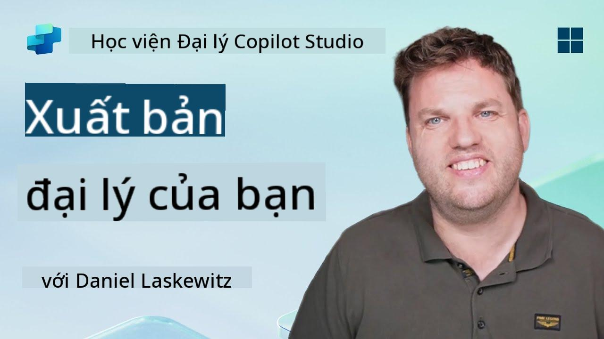](https://www.youtube.com/watch?v=eVZmljhYlSI "Xem hướng dẫn trên YouTube")

## 🎯 Tóm tắt nhiệm vụ

Sau khi hoàn thành một loạt các module đầy thử thách, Nhà sáng tạo Agent, bạn đã sẵn sàng cho bước quan trọng nhất: xuất bản agent của mình. Đã đến lúc đưa sáng tạo của bạn đến với người dùng trên Microsoft Teams và Microsoft 365 Copilot.

Agent của bạn—được trang bị một nhiệm vụ rõ ràng, các công cụ mạnh mẽ và quyền truy cập vào các nguồn kiến thức quan trọng—đã sẵn sàng phục vụ. Sử dụng Microsoft Copilot Studio, bạn sẽ triển khai agent của mình để nó có thể bắt đầu hỗ trợ người dùng thực tế, ngay tại nơi họ làm việc.

Hãy đưa agent của bạn vào hoạt động.

## 🔎 Mục tiêu

📖 Bài học này bao gồm:

1. Tại sao việc xuất bản agent lại quan trọng
1. Điều gì xảy ra khi bạn xuất bản agent
1. Cách thêm kênh (Microsoft Teams & Microsoft 365 Copilot)
1. Cách thêm agent vào Microsoft Teams
1. Cách làm cho agent khả dụng trong Microsoft Teams cho toàn bộ tổ chức của bạn

## 🚀 Xuất bản một agent

Mỗi khi bạn làm việc trên một agent trong Copilot Studio, bạn có thể cập nhật nó bằng cách thêm kiến thức hoặc công cụ. Khi bạn đã hoàn thành tất cả các thay đổi và kiểm tra kỹ lưỡng, bạn đã sẵn sàng để xuất bản nó. Việc xuất bản đảm bảo rằng các cập nhật mới nhất sẽ được áp dụng. Nếu bạn cập nhật agent của mình với các công cụ mới mà không nhấn nút xuất bản, các thay đổi đó sẽ chưa khả dụng cho người dùng cuối.

Hãy đảm bảo luôn nhấn nút xuất bản khi bạn muốn đẩy các cập nhật đến người dùng của agent. Agent của bạn có thể đã được thêm các kênh và khi bạn nhấn nút xuất bản, các cập nhật sẽ khả dụng cho tất cả các kênh mà bạn đã thêm vào agent.

## ⚙️ Cấu hình kênh

Các kênh xác định nơi người dùng của bạn có thể truy cập và tương tác với agent của bạn. Sau khi bạn xuất bản agent, bạn có thể làm cho nó khả dụng trên nhiều kênh. Mỗi kênh có thể hiển thị nội dung của agent theo cách khác nhau.

Bạn có thể thêm agent của mình vào các kênh sau:

- **Microsoft Teams và Microsoft 365 Copilot** - Làm cho agent của bạn khả dụng trong các cuộc trò chuyện và cuộc họp trên Teams, cũng như trong các trải nghiệm Microsoft 365 Copilot ([Tìm hiểu thêm](https://learn.microsoft.com/microsoft-copilot-studio/publication-add-bot-to-microsoft-teams))
- **Trang web demo** - Kiểm tra agent của bạn trên trang web demo do Copilot Studio cung cấp ([Tìm hiểu thêm](https://learn.microsoft.com/microsoft-copilot-studio/publication-connect-bot-to-web-channels))
- **Trang web tùy chỉnh** - Nhúng trực tiếp agent của bạn vào trang web của riêng bạn ([Tìm hiểu thêm](https://learn.microsoft.com/microsoft-copilot-studio/publication-connect-bot-to-web-channels))
- **Ứng dụng di động** - Tích hợp agent của bạn vào ứng dụng di động tùy chỉnh ([Tìm hiểu thêm](https://learn.microsoft.com/microsoft-copilot-studio/publication-connect-bot-to-custom-application))
- **SharePoint** - Thêm agent của bạn vào các trang SharePoint để hỗ trợ tài liệu và trang web ([Tìm hiểu thêm](https://learn.microsoft.com/microsoft-copilot-studio/publication-add-bot-to-sharepoint))
- **Facebook Messenger** - Kết nối với người dùng thông qua nền tảng nhắn tin của Facebook ([Tìm hiểu thêm](https://learn.microsoft.com/microsoft-copilot-studio/publication-add-bot-to-facebook))
- **Power Pages** - Tích hợp agent của bạn vào các trang web Power Pages ([Tìm hiểu thêm](https://learn.microsoft.com/microsoft-copilot-studio/publication-add-bot-to-power-pages))
- **Kênh Azure Bot Service** - Truy cập các kênh bổ sung bao gồm Slack, Telegram, Twilio SMS, và nhiều hơn nữa ([Tìm hiểu thêm](https://learn.microsoft.com/microsoft-copilot-studio/publication-connect-bot-to-azure-bot-service-channels))

Để thêm một kênh, hãy điều hướng đến tab **Channels** trong agent của bạn và chọn kênh bạn muốn cấu hình. Mỗi kênh có các yêu cầu thiết lập cụ thể và có thể yêu cầu thêm các bước xác thực hoặc cấu hình.

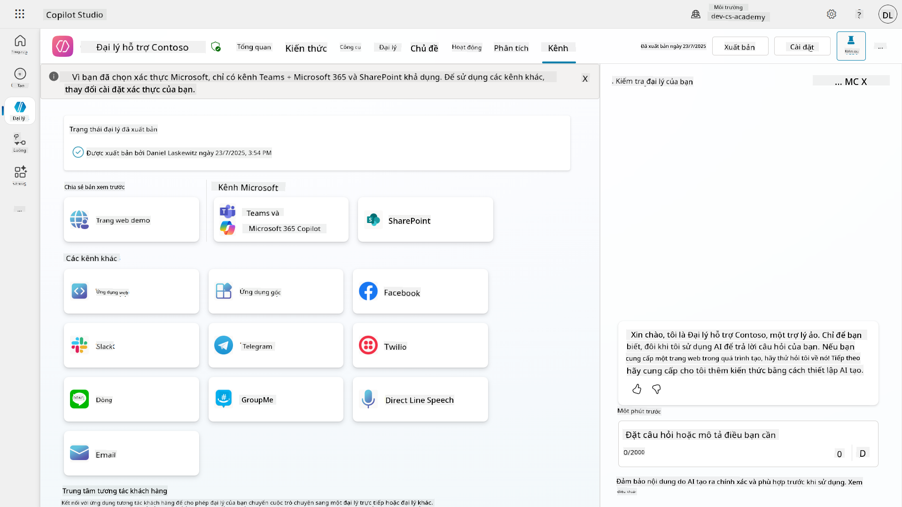

## 📺 Trải nghiệm kênh

Các kênh khác nhau có trải nghiệm người dùng khác nhau. Khi xây dựng một agent cho nhiều kênh, hãy đảm bảo bạn nhận thức được sự khác biệt giữa các kênh. Luôn là một chiến lược tốt để kiểm tra agent của bạn trên nhiều kênh để xem liệu nó có thực hiện đúng như bạn mong muốn hay không.

| Trải nghiệm                        | Trang web     | Teams và Microsoft 365 Copilot         | Facebook                 | Dynamics Omnichannel for Customer Service                   |
| ---------------------------------- | ------------- | --------------------------------------- | ------------------------ | ----------------------------------------------------------- |
| [Khảo sát sự hài lòng của khách hàng][1] | Thẻ thích ứng | Chỉ văn bản                             | Chỉ văn bản              | Chỉ văn bản                                                 |
| [Tùy chọn nhiều lựa chọn][1]       | Hỗ trợ        | [Hỗ trợ tối đa sáu (dưới dạng thẻ hero)][4] | [Hỗ trợ tối đa 13][6]    | [Hỗ trợ một phần][8]                                        |
| [Markdown][2]                      | Hỗ trợ        | [Hỗ trợ một phần][5]                    | [Hỗ trợ một phần][7]     | [Hỗ trợ một phần][9]                                        |
| [Tin nhắn chào mừng][1]            | Hỗ trợ        | Hỗ trợ                                 | Không hỗ trợ             | Hỗ trợ cho [Chat][10]. Không hỗ trợ cho các kênh khác.     |
| [Did-You-Mean][3]                  | Hỗ trợ        | Hỗ trợ                                 | Hỗ trợ                   | Hỗ trợ cho [Microsoft Teams][11], [Chat][10], Facebook, và các kênh chỉ văn bản (dịch vụ tin nhắn ngắn (SMS) qua [TeleSign][12] và [Twilio][13], [WhatsApp][14], [WeChat][15], và [Twitter][16]). Các hành động được gợi ý được trình bày dưới dạng danh sách chỉ văn bản; người dùng phải nhập lại một tùy chọn để phản hồi. |

[1]: https://learn.microsoft.com/microsoft-copilot-studio/authoring-create-edit-topics
[2]: https://daringfireball.net/projects/markdown/
[3]: https://learn.microsoft.com/microsoft-copilot-studio/advanced-ai-features
[4]: https://learn.microsoft.com/microsoftteams/platform/concepts/cards/cards-reference#hero-card
[5]: https://learn.microsoft.com/microsoftteams/platform/bots/how-to/format-your-bot-messages#text-only-messages
[6]: https://developers.facebook.com/docs/messenger-platform/send-messages/quick-replies/
[7]: https://www.facebook.com/help/147348452522644?helpref=related
[8]: https://learn.microsoft.com/dynamics365/customer-service/asynchronous-channels#suggested-actions-support
[9]: https://learn.microsoft.com/dynamics365/customer-service/asynchronous-channels#preview-support-for-formatted-messages
[10]: https://learn.microsoft.com/dynamics365/customer-service/set-up-chat-widget
[11]: https://learn.microsoft.com/dynamics365/customer-service/configure-microsoft-teams
[12]: https://learn.microsoft.com/dynamics365/customer-service/configure-sms-channel
[13]: https://learn.microsoft.com/dynamics365/customer-service/configure-sms-channel-twilio
[14]: https://learn.microsoft.com/dynamics365/customer-service/configure-whatsapp-channel
[15]: https://learn.microsoft.com/dynamics365/customer-service/configure-wechat-channel
[16]: https://learn.microsoft.com/dynamics365/customer-service/configure-twitter-channel

> [!NOTE]
> Có một số ví dụ về cách bạn có thể sử dụng logic khác nhau cho các kênh khác nhau. Một ví dụ về điều này có thể được tìm thấy trong kho lưu trữ Power Platform Snippets:
>
> Henry Jammes đã chia sẻ một ví dụ về cách hiển thị một thẻ thích ứng khác khi kênh là Microsoft Teams. ([Liên kết đến ví dụ](https://github.com/pnp/powerplatform-snippets/blob/main/copilot-studio/multiple-topics-matched-topic/source/multiple-topics-matched.yaml#L40))

## 🧪 Bài thực hành 11: Xuất bản agent của bạn lên Teams và Microsoft 365 Copilot

### 🎯 Trường hợp sử dụng

Agent hỗ trợ IT của Contoso của bạn hiện đã được cấu hình đầy đủ với các khả năng mạnh mẽ—nó có thể truy cập các nguồn kiến thức trên SharePoint, tạo phiếu hỗ trợ, gửi thông báo chủ động và phản hồi thông minh các câu hỏi của người dùng. Tuy nhiên, tất cả các tính năng này hiện chỉ khả dụng trong môi trường phát triển nơi bạn đã xây dựng chúng.

**Thách thức:** Người dùng cuối không thể tận dụng các khả năng của agent của bạn cho đến khi nó được xuất bản đúng cách và làm cho khả dụng thông qua các kênh mà họ thực sự làm việc.

**Giải pháp:** Việc xuất bản agent của bạn đảm bảo rằng phiên bản mới nhất—với tất cả các cập nhật gần đây, các chủ đề mới, các nguồn kiến thức được nâng cao và các luồng được cấu hình—sẽ khả dụng cho người dùng thực tế. Nếu không xuất bản, người dùng vẫn sẽ tương tác với phiên bản cũ của agent của bạn, có thể thiếu các chức năng quan trọng.

Việc thêm kênh Teams và Microsoft 365 Copilot cũng rất quan trọng vì:

- **Tích hợp Teams**: Nhân viên trong tổ chức của bạn dành phần lớn thời gian của họ trên Microsoft Teams để cộng tác, họp và giao tiếp. Bằng cách thêm agent của bạn vào Teams, người dùng có thể nhận hỗ trợ IT mà không cần rời khỏi môi trường làm việc chính của họ.

- **Microsoft 365 Copilot**: Người dùng có thể truy cập agent hỗ trợ IT chuyên biệt của bạn trực tiếp trong trải nghiệm Microsoft 365 Copilot, giúp tích hợp liền mạch vào quy trình làm việc hàng ngày của họ trên các ứng dụng Office.

- **Truy cập tập trung**: Thay vì phải nhớ các trang web hoặc ứng dụng riêng biệt, người dùng có thể truy cập hỗ trợ IT thông qua các nền tảng mà họ đã sử dụng, giảm thiểu sự phức tạp và tăng cường sự chấp nhận.

Nhiệm vụ này biến công việc phát triển của bạn thành một giải pháp sẵn sàng sản xuất, mang lại giá trị thực sự cho người dùng cuối trong tổ chức của bạn.

### Điều kiện tiên quyết

Trước khi bắt đầu bài thực hành này, hãy đảm bảo rằng bạn đã:

- ✅ Hoàn thành các bài thực hành trước đó và có một Agent hỗ trợ IT Contoso được cấu hình đầy đủ
- ✅ Agent của bạn đã được kiểm tra và sẵn sàng để sử dụng trong môi trường sản xuất
- ✅ Có quyền trong môi trường Copilot Studio để xuất bản agent
- ✅ Truy cập vào Microsoft Teams trong tổ chức của bạn

### 11.1 Xuất bản agent của bạn

Bây giờ tất cả công việc của chúng ta trên agent đã hoàn thành, chúng ta cần đảm bảo rằng tất cả công việc của chúng ta sẽ khả dụng cho người dùng cuối sẽ sử dụng agent. Để đảm bảo nội dung khả dụng cho tất cả người dùng, chúng ta cần xuất bản agent của mình.

1. Đi đến Agent hỗ trợ IT Contoso trong Copilot Studio (thông qua [cổng nhà sáng tạo Copilot Studio](https://copilotstudio.microsoft.com))

    Trong Copilot Studio, việc xuất bản agent của bạn rất dễ dàng. Bạn chỉ cần chọn nút xuất bản ở đầu trang tổng quan của agent.

    

1. Chọn nút **Publish** trong agent của bạn

    Một cửa sổ bật lên xuất hiện - để xác nhận rằng bạn thực sự muốn xuất bản agent của mình.

    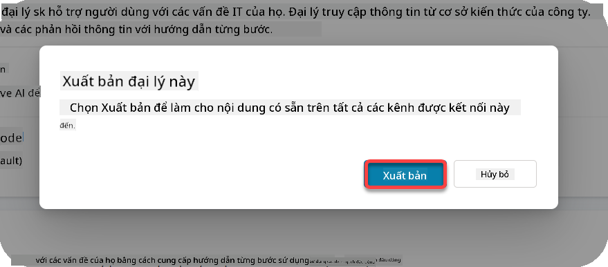

1. Chọn **Publish** để xác nhận việc xuất bản agent của bạn

    Bây giờ một thông báo sẽ hiển thị rằng agent của bạn đang được xuất bản. Bạn không cần phải giữ cửa sổ bật lên đó mở. Bạn sẽ nhận được thông báo khi agent đã được xuất bản.

    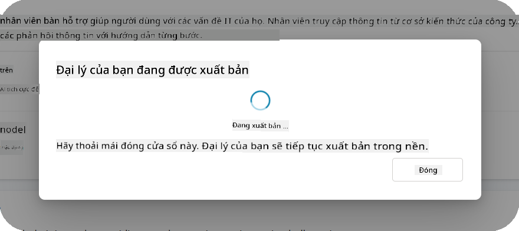

    Khi agent đã được xuất bản xong, bạn sẽ thấy thông báo ở đầu trang của agent.

    

Nhưng - chúng ta chỉ mới xuất bản agent, chưa thêm nó vào kênh nào cả, vì vậy hãy làm điều đó ngay bây giờ!

### 11.2 Thêm kênh Teams và Microsoft 365 Copilot

1. Để thêm kênh Teams và Microsoft 365 Copilot vào agent của chúng ta, chúng ta cần chọn **Channel** trong thanh điều hướng trên cùng của agent

    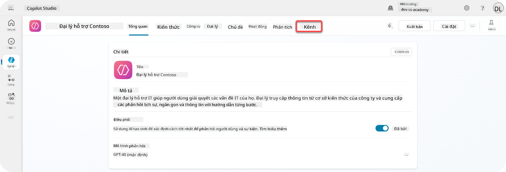

    Tại đây chúng ta có thể thấy tất cả các kênh mà chúng ta có thể thêm vào agent này.

1. Chọn **Teams và Microsoft 365**

    

1. Chọn **Add channel** để hoàn tất trình hướng dẫn và thêm kênh vào agent

    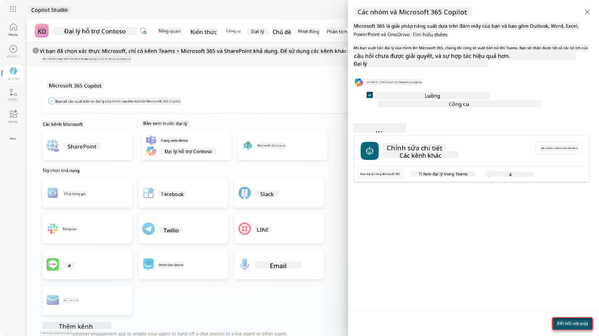

    Sẽ mất một chút thời gian để thêm. Sau khi thêm xong, một thông báo màu xanh lá cây sẽ xuất hiện ở đầu thanh bên.

    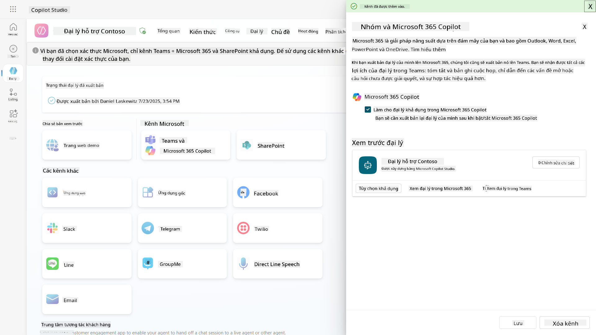

1. Chọn **See agent in Teams** để mở một tab mới

    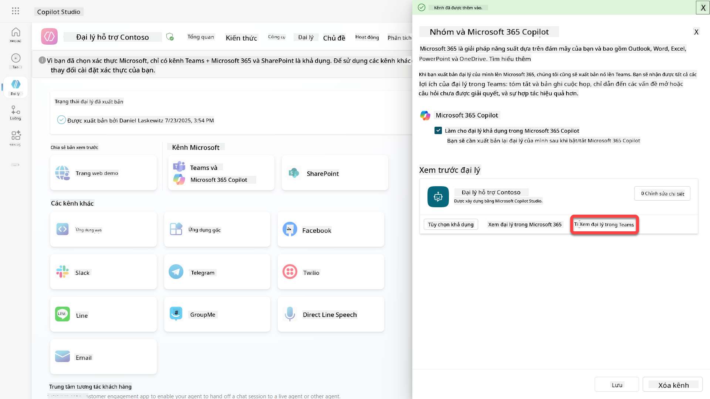

1. Chọn **Add** để thêm Agent hỗ trợ IT Contoso vào Teams

    

    Điều này sẽ mất một chút thời gian. Sau đó, màn hình sau sẽ hiển thị:

    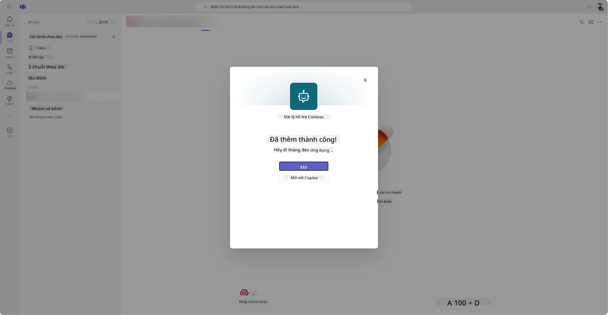

1. Chọn **Open** để mở agent trong Teams

    Điều này sẽ mở agent trong Teams dưới dạng một ứng dụng Teams

    

Bây giờ chúng ta đã xuất bản agent để hoạt động cho bạn trong Microsoft Teams, nhưng bạn có thể muốn làm cho nó khả dụng cho nhiều người hơn.

### 11.3 Làm cho agent khả dụng cho tất cả người dùng trong tenant

1. Đóng tab trình duyệt nơi Agent hỗ trợ IT Contoso đang mở

    Điều này sẽ đưa bạn trở lại Copilot Studio nơi bảng điều khiển Teams và Microsoft 365 Copilot vẫn đang mở. Chúng ta chỉ mới mở agent trong Teams, nhưng chúng ta có thể làm nhiều hơn nữa ở đây. Chúng ta có thể chỉnh sửa chi tiết của agent, triển khai agent cho nhiều người dùng hơn và nhiều hơn nữa.

1. Chọn **Edit details**

    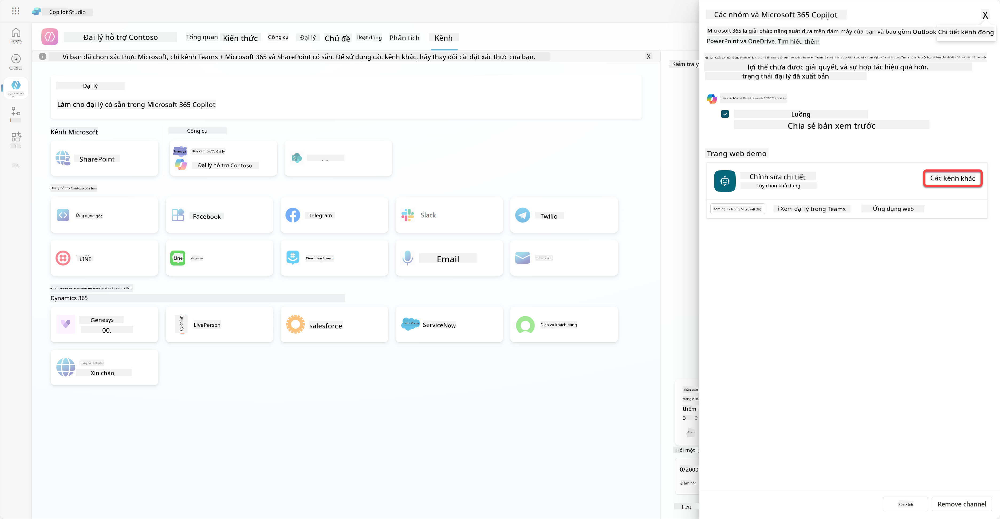
Điều này sẽ mở một bảng nơi chúng ta có thể thay đổi một loạt chi tiết và cài đặt của agent. Chúng ta có thể thay đổi các chi tiết cơ bản như biểu tượng, màu nền của biểu tượng và mô tả. Chúng ta cũng có thể thay đổi cài đặt Teams (ví dụ như cho phép người dùng thêm agent vào một nhóm, hoặc cho phép sử dụng agent này trong các cuộc trò chuyện nhóm và họp) tại đây. Khi bạn chọn *more*, bạn cũng có thể thay đổi các chi tiết dành cho nhà phát triển như tên nhà phát triển, trang web, tuyên bố quyền riêng tư và điều khoản sử dụng.

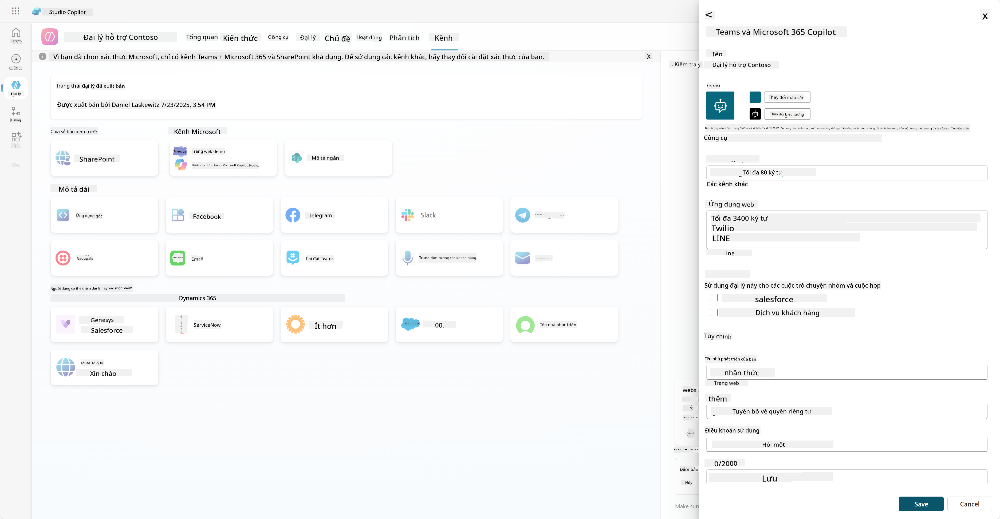

1. Chọn **Cancel** để đóng bảng chỉnh sửa chi tiết

1. Chọn **Availability options**

Điều này sẽ mở bảng tùy chọn khả dụng, nơi bạn có thể sao chép một liên kết để gửi cho người dùng sử dụng agent này (lưu ý, bạn cần chia sẻ agent với người dùng nữa) và bạn có thể tải xuống một tệp để thêm agent của bạn vào Microsoft Teams hoặc Microsoft 365 store. Để hiển thị agent trong store, bạn có các tùy chọn khác: bạn có thể hiển thị nó cho đồng đội và người dùng được chia sẻ (để hiển thị trong phần *Built with Power Platform*) hoặc bạn có thể hiển thị nó cho tất cả mọi người trong tổ chức của bạn (điều này cần sự phê duyệt của quản trị viên).

1. Chọn **Show to everyone in my org**

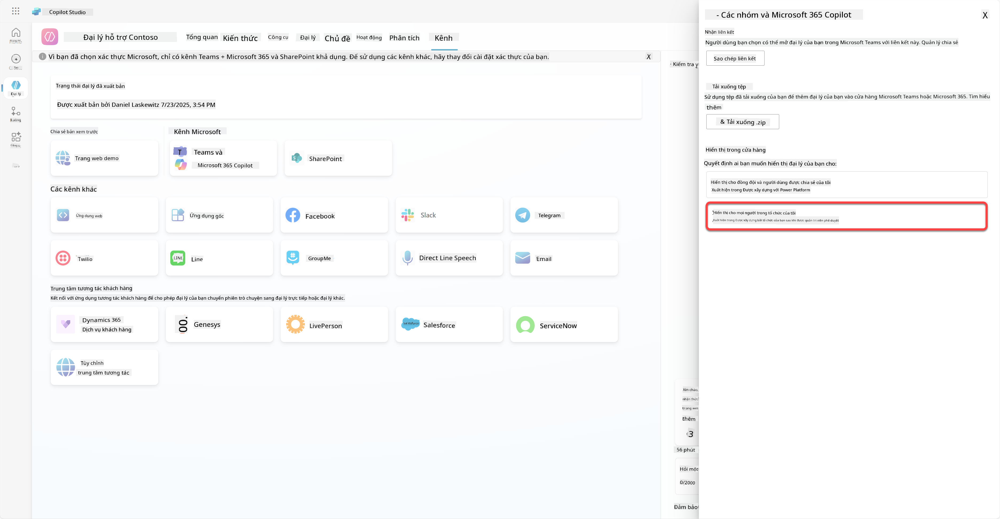

1. Chọn **Submit for admin approval**

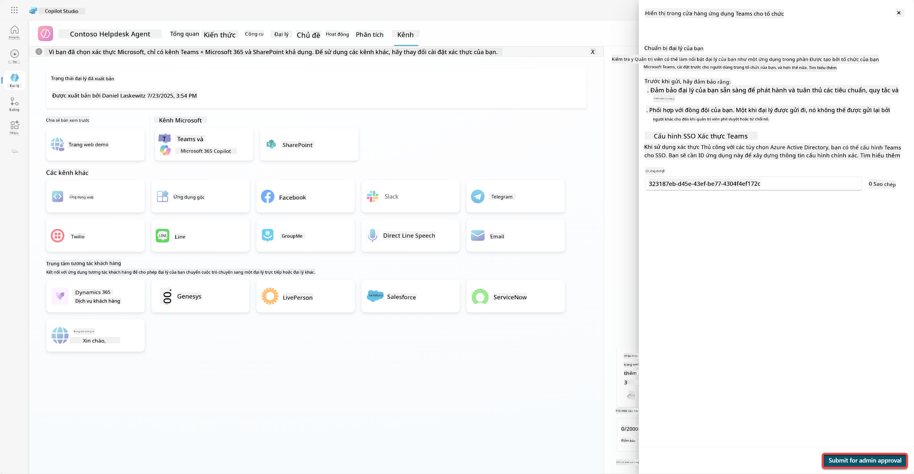

Bây giờ, quản trị viên của bạn phải phê duyệt việc gửi agent của bạn. Họ có thể làm điều đó bằng cách vào Teams Admin Center và tìm kiếm Contoso Helpdesk Agent trong Apps. Trong ảnh chụp màn hình, bạn có thể thấy những gì quản trị viên sẽ thấy trong Teams Admin Center.

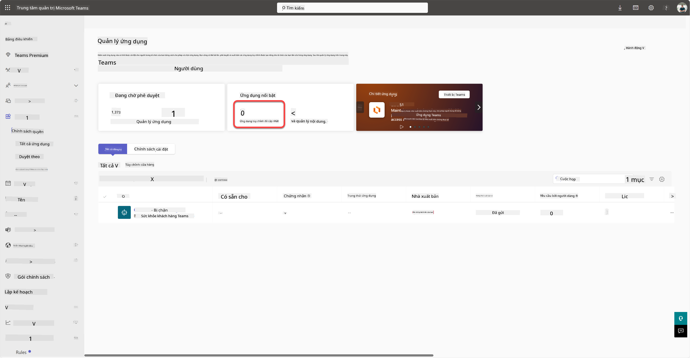

Quản trị viên phải chọn Contoso Helpdesk Agent và chọn *Publish* để xuất bản Contoso Helpdesk Agent cho mọi người.

Khi quản trị viên đã xuất bản việc gửi agent, bạn sẽ có thể làm mới Copilot Studio và bạn sẽ thấy banner *available in app store* trong tùy chọn khả dụng.

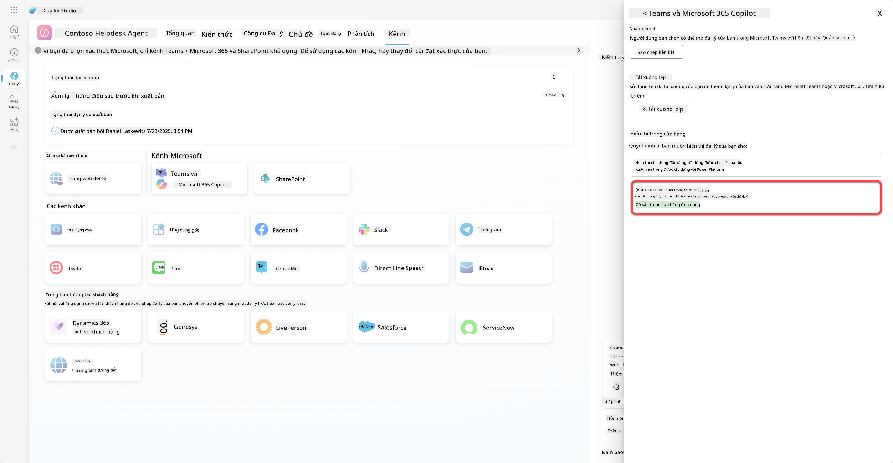

Ở đây còn có nhiều khả năng hơn nữa. Quản trị viên của bạn có thể thay đổi chính sách thiết lập toàn cầu và tự động cài đặt Contoso Helpdesk Agent cho tất cả mọi người trong tenant. Ngoài ra - bạn có thể ghim Contoso Helpdesk Agent vào thanh bên trái để mọi người dễ dàng truy cập.

## ✅ Hoàn thành nhiệm vụ

🎉 **Chúc mừng!** Bạn đã xuất bản thành công agent của mình và thêm nó vào Teams và Microsoft 365 Copilot! Tiếp theo là nhiệm vụ cuối cùng của khóa học: Hiểu về cấp phép.

⏭️ [Chuyển đến bài học **Hiểu về cấp phép**](../12-understanding-licensing/README.md)

## 📚 Tài nguyên chiến thuật

🔗 [Tài liệu về kênh xuất bản](https://learn.microsoft.com/microsoft-copilot-studio/publication-fundamentals-publish-channels)

---

**Tuyên bố miễn trừ trách nhiệm**:  
Tài liệu này đã được dịch bằng dịch vụ dịch thuật AI [Co-op Translator](https://github.com/Azure/co-op-translator). Mặc dù chúng tôi cố gắng đảm bảo độ chính xác, xin lưu ý rằng các bản dịch tự động có thể chứa lỗi hoặc không chính xác. Tài liệu gốc bằng ngôn ngữ bản địa nên được coi là nguồn thông tin chính thức. Đối với thông tin quan trọng, nên sử dụng dịch vụ dịch thuật chuyên nghiệp bởi con người. Chúng tôi không chịu trách nhiệm cho bất kỳ sự hiểu lầm hoặc diễn giải sai nào phát sinh từ việc sử dụng bản dịch này.