<!--
CO_OP_TRANSLATOR_METADATA:
{
  "original_hash": "4fb913dfc3bbc71506dd3602c4b8e6ed",
  "translation_date": "2025-10-18T03:10:36+00:00",
  "source_file": "docs/operative-preview/02-multi-agent/README.md",
  "language_code": "zh"
}
-->
# 🚨 任务 02：连接代理

--8<-- "disclaimer.md"

## 🕵️‍♂️ 代号：`交响乐行动`

> **⏱️ 行动时间窗口：** `~45分钟`

## 🎯 任务简报

欢迎回来，特工。在任务01中，你已经构建了主要的招聘代理——一个管理招聘流程的坚实基础。但单个代理的能力是有限的。

如果你选择接受任务，那么你的任务是**交响乐行动**——将你的单一代理转变为一个**多代理系统**：一个协调的专业代理团队，能够协作应对复杂的招聘挑战。就像一个交响乐团，每个音乐家都在完美的和谐中演奏自己的部分，你将为现有的招聘代理添加两个关键的专业代理：一个自动处理简历的申请接收代理，以及一个创建全面面试材料的面试准备代理。这些代理将在你的主要协调者的管理下无缝协作。

## 🔎 目标

在本次任务中，你将学习：

1. 何时使用**子代理**与**连接代理**
2. 如何设计可扩展的**多代理架构**
3. 创建用于专注任务的**子代理**
4. 建立代理之间的**通信模式**
5. 构建申请接收代理和面试准备代理

## 🧠 什么是连接代理？

在Copilot Studio中，你不仅限于构建单一的、单一功能的代理。你可以创建**多代理系统**——由多个专业代理组成的网络，协同处理复杂的工作流程。

可以将其想象为一个现实世界的组织：与其让一个人完成所有工作，不如让擅长特定任务的专家在需要时协作完成。

### 为什么多代理系统很重要

- **可扩展性：** 每个代理可以由不同的团队独立开发、测试和维护。  
- **专业化：** 代理可以专注于自己最擅长的领域。例如，一个负责数据处理，另一个负责用户交互，还有一个负责决策制定。  
- **灵活性：** 你可以混合搭配代理，在多个项目中重复使用它们，并逐步改进你的系统。  
- **可维护性：** 对一个代理的更改不会影响其他代理，从而使更新更安全、更容易。

### 现实案例：招聘流程

以我们的招聘工作流程为例——多个代理可以协同工作，分别负责以下任务：

- **简历接收**需要文档解析和数据提取技能
- **评分**需要评估候选人简历并将其与职位要求匹配
- **面试准备**需要深入分析候选人是否适合
- **候选人沟通**需要具备同理心的沟通能力

与其构建一个试图处理所有这些不同技能的庞大代理，不如为每个领域创建专业代理并将它们协调在一起。

## 🔗 子代理与连接代理：关键区别

Copilot Studio 提供了两种构建多代理系统的方法，每种方法都有其特定的使用场景：

### ↘️ 子代理

子代理是**轻量级的专家**，它们存在于你的主代理中。可以将它们视为同一部门内的专业团队。

#### 关键技术细节

- 子代理存在于父代理中，并且有一个单独的配置页面。
- 工具和知识**存储在父代理**中，但可以配置为“可供”子代理使用。
- 子代理**共享父代理的主题**。子代理的指令可以引用这些主题。
- 子代理**无需单独发布**——一旦创建，它们会自动在父代理中可用。这使得测试更加容易，因为可以在**同一个共享工作区**中对父代理和子代理进行更改。

#### 适合使用子代理的场景

- 整个解决方案由一个团队管理
- 你希望将工具和知识逻辑地组织到子代理中
- 你不需要为每个代理单独进行身份验证或部署
- 代理不会单独发布或独立使用
- 你不需要在多个解决方案中重复使用代理

**示例：** 一个IT帮助台代理，拥有以下子代理：

- 密码重置流程
- 硬件故障排除  
- 软件安装指南

### 🔀 连接代理

连接代理是**完全独立的代理**，你的主代理可以与之协作。可以将它们视为在项目中协作的独立部门。

#### 关键技术细节

- 连接代理有**自己的主题**和对话流程。它们以自己的设置、逻辑和部署生命周期独立运行。
- 连接代理**必须发布**后才能被其他代理添加和使用。
- 在测试期间，连接代理的更改必须发布后才能被调用代理使用。

#### 适合使用连接代理的场景

- 不同的团队独立开发和维护不同的代理
- 代理需要自己的设置、身份验证和部署渠道
- 你希望单独发布和维护代理，并为每个代理提供独立的应用程序生命周期管理（ALM）
- 代理需要在多个解决方案中重复使用

**示例：** 一个客户服务系统连接到：

- 由财务团队维护的单独账单代理
- 由产品团队维护的单独技术支持代理
- 由运营团队维护的单独退货代理

!!! tip "提示"
    你可以混合使用这两种方法！例如，你的主代理可以连接到其他团队的外部代理，同时也拥有自己的子代理来处理内部的专业任务。

## 🎯 多代理架构模式

在设计多代理系统时，根据代理的交互方式会出现几种模式：

| 模式                | 描述                                                                 | 最适合的场景                                                  |
|----------------------|---------------------------------------------------------------------|---------------------------------------------------------------|
| **中心辐射型**       | 一个主协调代理与多个专业代理协作。协调代理处理用户交互，并将任务分配给子代理或连接代理。 | 复杂的工作流程，其中一个代理协调多个专业任务                   |
| **流水线型**         | 代理按顺序传递工作，每个代理在传递到下一阶段之前增加价值。           | 线性流程，如申请处理（接收→筛选→面试→决策）                  |
| **协作型**           | 代理同时在同一问题的不同方面工作，共享上下文和结果。                 | 需要多个视角或专业领域的复杂分析                              |

!!! tip "提示"
    你甚至可以结合两种或多种模式。

## 💬代理通信与上下文共享

当代理协作时，它们需要有效地共享信息。在Copilot Studio中，以下是实现方式：

### 对话历史

默认情况下，当主代理调用子代理或连接代理时，可以传递**对话历史**。这使得专业代理能够完全了解用户正在讨论的内容。

你可以出于安全或性能原因禁用此功能——例如，如果专业代理只需要完成特定任务而不需要完整的对话上下文。这可以有效防止**数据泄露**。

### 明确指令

你的主代理可以向子代理或连接代理提供**具体指令**。例如：“处理这份简历并总结其适合高级开发人员职位的技能。”

### 返回值

代理可以将结构化信息返回给调用代理，从而使主代理能够在后续步骤中使用这些信息，或者与其他代理共享。

### Dataverse 集成

对于更复杂的场景，代理可以通过**Dataverse**或其他数据存储共享信息，从而在多次交互中实现持久的上下文共享。

## ↘️子代理：申请接收代理

让我们开始构建我们的多代理招聘系统。我们的第一个专家将是**申请接收代理**——一个负责处理收到的简历和候选人信息的子代理。

```mermaid
---
config:
  layout: elk
  look: neo
---
flowchart TB
 subgraph People["People"]
    direction TB
        HiringManager["Hiring Manager"]
        Interviewers["Interviewers"]
  end
 subgraph Agents["Agents"]
    direction LR
        ApplicationIntakeAgent["Application Intake Agent<br>(Child)"]
        InterviewAgent["Interview Agent<br>(Connected)"]
        HRAgent["HR Agent"]
  end
    HiringManager -- Upload CV --> HRAgent
    HRAgent -- Upload Resume, Create Candidate, Match to Job Roles --> ApplicationIntakeAgent
    ApplicationIntakeAgent -- Create Resume, Upsert Candidate, Create Job Application --> Dataverse["Dataverse"]
    ApplicationIntakeAgent -- Store Resume file in file column --> Dataverse
    HiringManager -- Ask for summaries --> HRAgent
    Interviewers -- Request interview pack --> HRAgent
    HRAgent -- Generate interview pack and summarize data --> InterviewAgent
    InterviewAgent -- Read all Candidate, Resume, Job Roles, Evaluation Criteria Data --> Dataverse
     HiringManager:::person
     Interviewers:::person
     ApplicationIntakeAgent:::agent
     InterviewAgent:::agent
     HRAgent:::agent
     Dataverse:::data
    classDef person fill:#e6f0ff,stroke:#3b82f6,color:#0b3660
    classDef agent fill:#e8f9ef,stroke:#10b981,color:#064e3b
    classDef data  fill:#f3f4f6,stroke:#6b7280,color:#111827
```

### 🤝申请接收代理的职责

- **解析简历内容**，从通过交互式聊天提供的PDF中提取信息（在未来的任务中，你将学习如何自动处理简历）。
- **提取结构化数据**（姓名、技能、经验、教育背景）
- **根据资格和求职信**将候选人匹配到空缺职位
- **将候选人信息存储**在Dataverse中以供后续处理
- **去重申请**，避免重复创建相同的候选人，使用从简历中提取的电子邮件地址匹配现有记录。

### ⭐为什么它应该是一个子代理

申请接收代理非常适合作为子代理，因为：

- 它专注于文档处理和数据提取
- 它不需要单独发布  
- 它是由同一个团队管理的整体招聘解决方案的一部分
- 它专注于一个特定的触发器（收到新简历）并由招聘代理调用。

## 🔀连接代理：面试准备代理  

我们的第二个专家将是**面试准备代理**——一个连接代理，帮助创建全面的面试材料并评估候选人的回答。

### 🤝面试准备代理的职责

- **创建面试包**，包括公司信息、职位要求和评估标准
- **生成面试问题**，根据具体职位和候选人背景量身定制
- **回答关于职位和申请的常见问题**，以便与利益相关者沟通

### ⭐为什么它应该是一个连接代理

面试准备代理更适合作为一个连接代理，因为：

- 人才招聘团队可能希望在多个招聘流程中独立使用它
- 它需要自己的面试最佳实践和评估标准知识库
- 不同的招聘经理可能希望为他们的团队定制其行为
- 它可以用于内部职位，而不仅仅是外部招聘

## 🧪实验 2.1：添加申请接收代理

准备好将理论付诸实践了吗？让我们为现有的招聘代理添加第一个子代理。

### 完成此任务的前提条件

你需要**以下之一**：

- **完成任务01**并准备好你的招聘代理，**或者**
- **导入任务02的起始解决方案**，如果你是从头开始或需要补课。[下载任务02起始解决方案](https://aka.ms/agent-academy)

!!! note "解决方案导入和示例数据"
    如果你正在使用起始解决方案，请参考[任务01](../01-get-started/README.md)获取有关如何将解决方案和示例数据导入到你的环境中的详细说明。

### 2.1.1 解决方案设置

1. 在Copilot Studio中，选择左侧导航栏中工具下方的省略号（...）。
1. 选择**解决方案**。  
    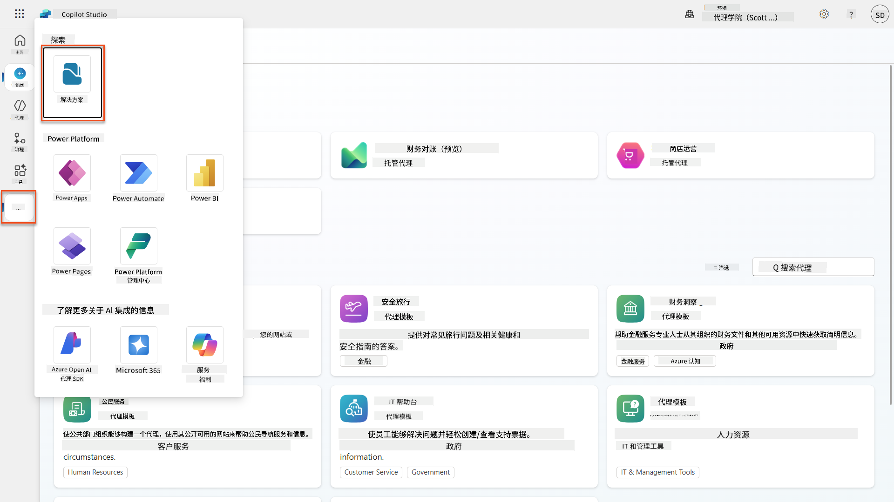
1. 找到你的Operative解决方案，选择其旁边的**省略号（...）**，然后选择**设置为首选解决方案**。这将确保你的所有工作都将添加到此解决方案中。  
    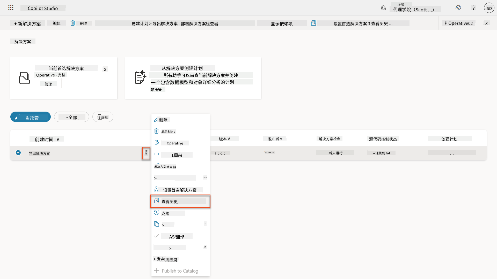

### 2.1.2 配置你的招聘代理指令

1. **导航**到Copilot Studio。确保在右上角的**环境选择器**中选择了你的环境。

1. 打开你在任务01中创建的**招聘代理**

1. 在**概览**选项卡的**指令**部分选择**编辑**，并在顶部添加以下指令：

    ```text
    You are the central orchestrator for the hiring process. You coordinate activities, provide summaries, and delegate work to specialized agents.
    ```

1. 选择**保存**  
    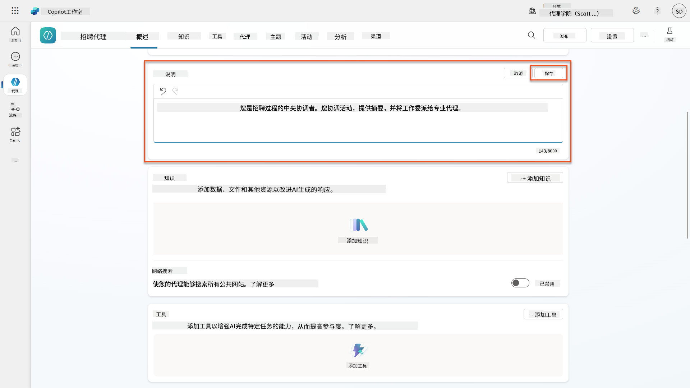

1. 选择**设置**（右上角）

1. 确保以下设置：

    | 设置 | 值 |
    |------|----|
    | 使用生成式AI协调代理的响应 | **是** |
    | 内容审核 | **中等** |
    | 使用通用知识 | **关闭** |
    | 使用网络信息 | **关闭** |
    | 文件上传 | **开启** |


### 2.1.3 添加申请接收子代理

1. **导航**到招聘代理中的**代理**选项卡——你将在这里添加专业代理。

1. 选择**+ 添加**，然后选择**创建一个代理**。注意，这里标注为“*创建一个轻量级代理，它存在于当前代理中并继承其设置。非常适合分解复杂逻辑*”。  
    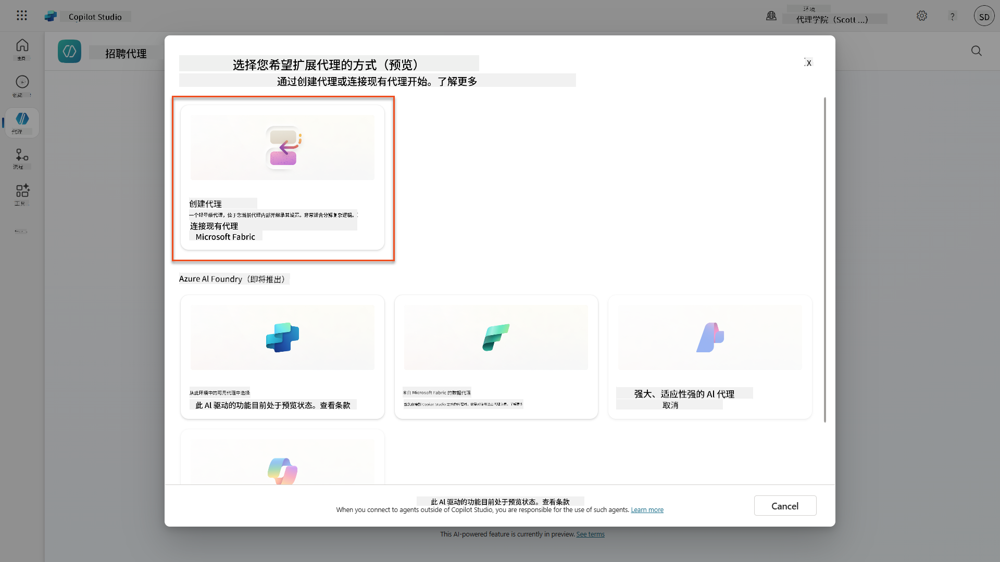

1. **命名**你的代理为`申请接收代理`

1. 在**何时使用此代理？**下拉菜单中选择**代理选择** - 基于描述。

1. 将**描述**设置为：

    ```text
    Processes incoming resumes and stores candidates in the system
    ```

    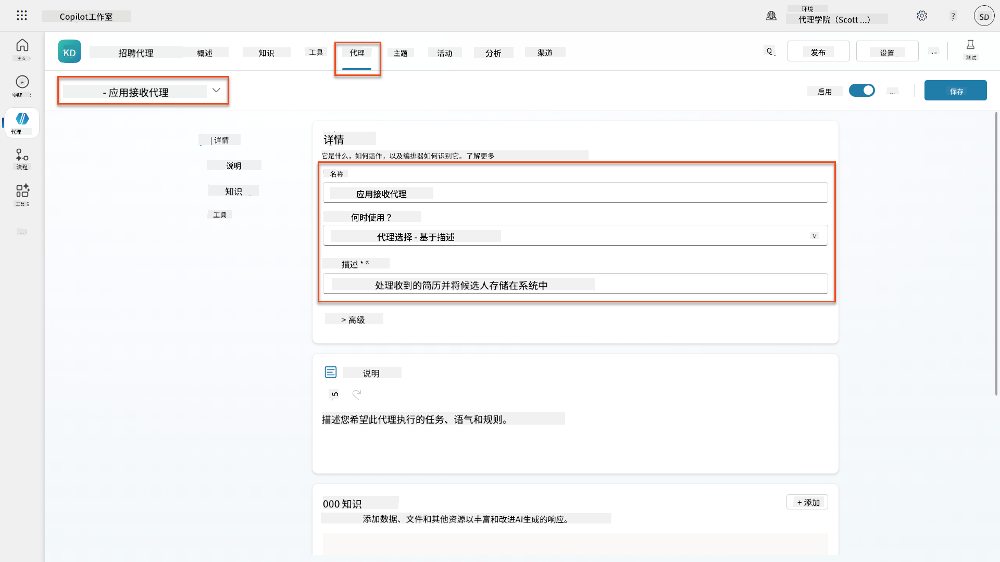

1. 展开**高级**，将优先级设置为`10000`。这将确保稍后面试代理在回答一般问题时优先于此代理。此处也可以设置条件，例如确保至少有一个附件。

1. 确保**网络搜索**切换设置为**禁用**。因为我们只希望使用父代理提供的信息。

1. 选择**保存**

### 2.1.4 配置简历上传代理流程

代理在没有工具或主题的情况下无法执行任何操作。
我们使用 **Agent Flow 工具** 而不是 Topics 来完成 *上传简历* 步骤，因为这个多步骤的后端流程需要确定性执行并与外部系统集成。虽然 Topics 更适合引导对话式交流，但 Agent Flows 提供了可靠处理文件处理、数据验证和数据库插入或更新所需的结构化自动化，而无需依赖用户交互。

1. 在 Application Intake Agent 页面中找到 **Tools** 部分。
   **重要提示：** 这不是父代理的 Tools 标签，而是可以在子代理说明下方向下滚动找到。

1. 选择 **+ Add**
   

1. 选择 **+ New tool** 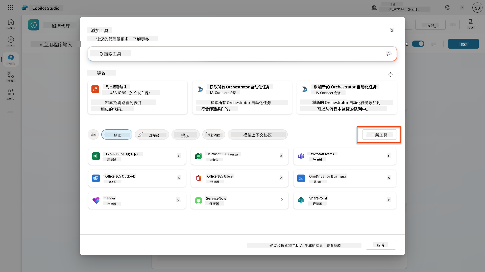

1. 选择 **Agent flow**。
   Agent Flow 设计器将打开，我们将在这里添加上传简历的逻辑。  
   

1. 选择 **When an agent calls the flow** 节点，并选择 **+ Add** 输入以下参数，确保添加名称和描述。

    | 类型  | 名称     | 描述                                                                                                   |
    |-------|----------|-------------------------------------------------------------------------------------------------------|
    | 文件  | Resume   | 简历 PDF 文件                                                                                         |
    | 文本  | Message  | 从上下文中提取封面信样式的消息。消息必须少于 2000 个字符。                                             |
    | 文本  | UserEmail| 简历来源的电子邮件地址。这将是聊天中上传简历的用户，或者是通过电子邮件接收时的发件人地址。               |

    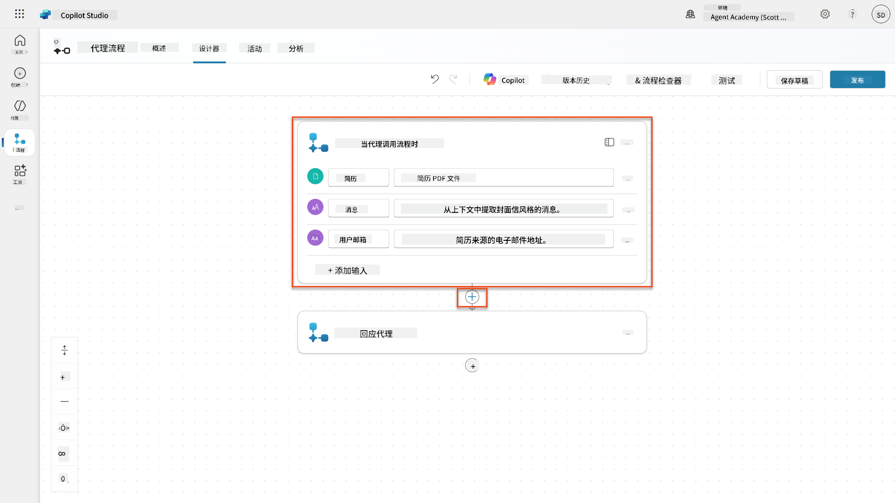

1. 选择触发节点下方的 **+ 图标**，搜索 `Dataverse`，选择 Microsoft Dataverse 旁边的 **See more**，然后在 **Microsoft Dataverse** 部分选择 **Add a new row** 操作  
    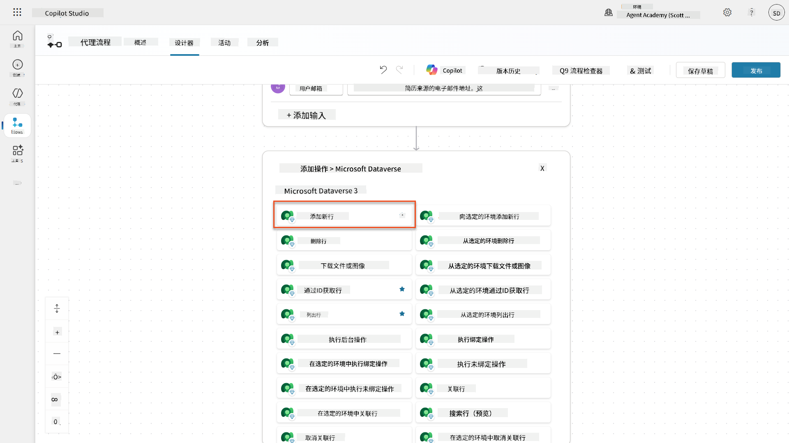

1. 通过选择 **省略号(...)** 并选择 **Rename** 将节点命名为 **Create Resume**  
    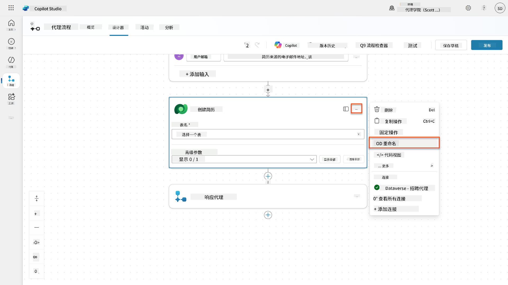

1. 将 **Table name** 设置为 **Resumes**，然后选择 **Show all**，以显示所有参数。

1. 设置以下 **属性**：

    | 属性                     | 设置方式                      | 详情 / 表达式                                                 |
    | ------------------------ | ---------------------------- | ------------------------------------------------------------ |
    | **Resume Title**         | 动态数据 (闪电图标)          | **When an agent calls the flow** → **Resume name** 如果看不到 Resume name，请确保您已将 Resume 参数配置为数据类型。 |
    | **Cover letter**         | 表达式 (fx 图标)             | `if(greater(length(triggerBody()?['text']), 2000), substring(triggerBody()?['text'], 0, 2000), triggerBody()?['text'])` |
    | **Source Email Address** | 动态数据 (闪电图标)          | **When an agent calls the flow** → **UserEmail**             |
    | **Upload Date**          | 表达式 (fx 图标)             | `utcNow()`                                                   |

    

1. 选择 **Create Resume** 节点下方的 **+ 图标**，搜索 `Dataverse`，选择 Microsoft Dataverse 旁边的 **See more**，然后选择 **Upload a file or an image** 操作。
   **重要提示：** 请确保不要选择上传文件或图像到选定环境的操作。

1. 通过选择 **省略号(...)** 并选择 **Rename** 将节点命名为 **Upload Resume File**

1. 设置以下 **属性**：

     | 属性 | 设置方式 | 详情 |
     |------|----------|------|
     | **Content name** | 动态数据 (闪电图标) | When an agent calls the flow → Resume name |
     | **Table name** | 选择 | Resumes |
     | **Row ID** | 动态数据 (闪电图标) | Create Resume → See more → Resume |
     | **Column Name** | 选择 | Resume PDF |
     | **Content** | 动态数据 (闪电图标) | When an agent calls the flow → Resume contentBytes |

     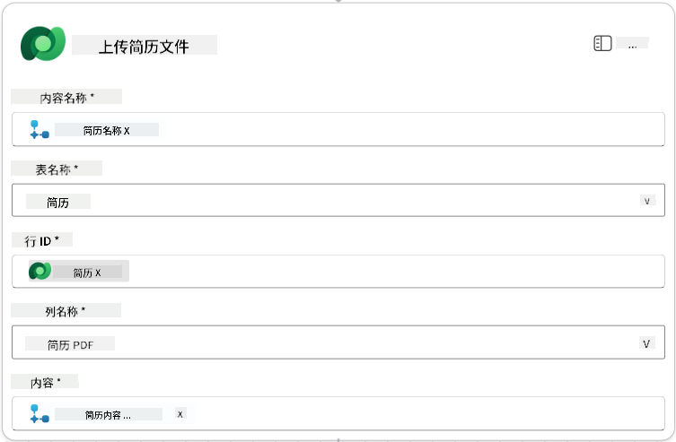

1. 选择 **Respond to the agent node**，然后选择 **+ Add an output**

     | 属性 | 设置方式 | 详情 |
     |------|----------|------|
     | **类型** | 选择 | `Text` |
     | **名称** | 输入 | `ResumeNumber` |
     | **值** | 动态数据 (闪电图标) | Create Resume → See More → Resume Number |
     | **描述** | 输入 | `创建的简历的 [ResumeNumber]` |

     

1. 选择右上角的 **Save draft**  
     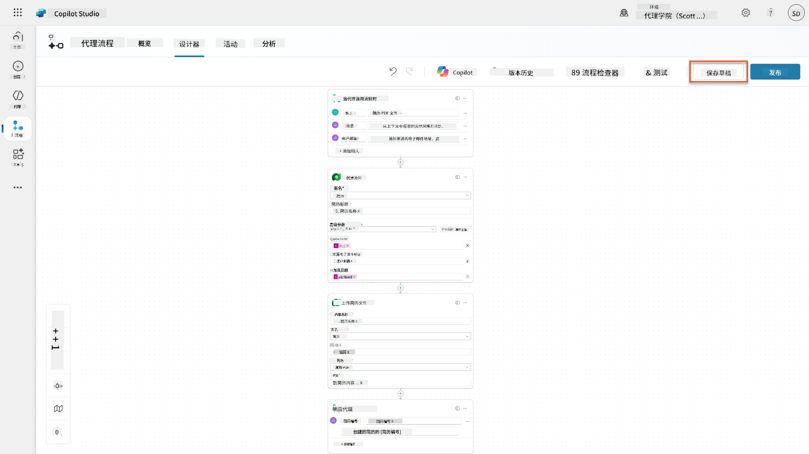

1. 选择 **Overview** 标签，在 **Details** 面板中选择 **Edit**

     1. **Flow name**:`Resume Upload`
     1. **Description**:`根据指示上传简历`

     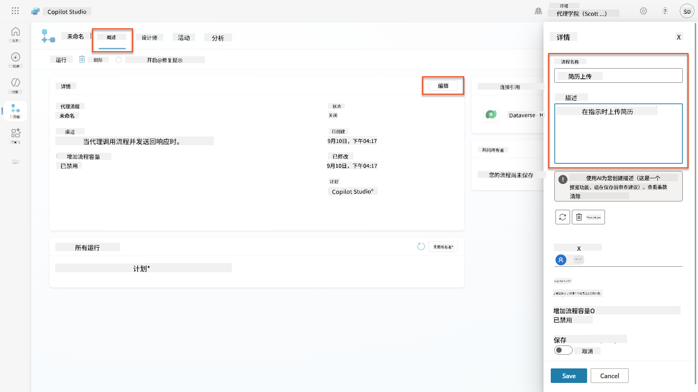

1. 再次选择 **Designer** 标签，然后选择 **Publish**。  
     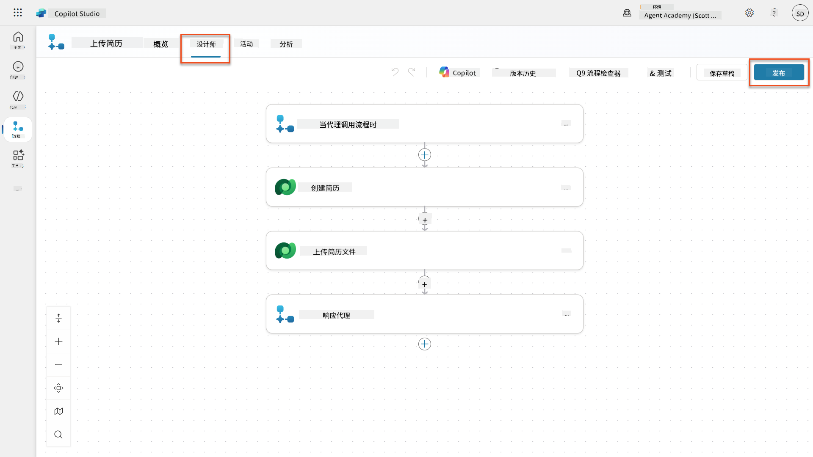

### 2.1.5 将流程连接到您的代理

现在，您将已发布的流程连接到您的 Application Intake Agent。

1. 返回到 **Hiring Agent** 并选择 **Agents** 标签。打开 **Application Intake Agent**，然后找到 **Tools** 面板。  
    

1. 选择 **+ Add**

1. 选择 **Flow** 筛选器，并搜索 `Resume Upload`。选择 **Resume Upload** 流程，然后 **Add and configure**。

1. 设置以下参数：

    | 参数 | 值 |
    |------|----|
    | **Description** | `根据指示上传简历。严格规则：仅在以 "Resume Upload" 形式引用并且有附件时调用此工具` |
    | **Additional details → When this tool may be used** | `仅在由 Topics 或代理引用时使用` |
    | **Inputs → Add Input** | `contentBytes` |
    | **Inputs → Add Input** | `name` |

    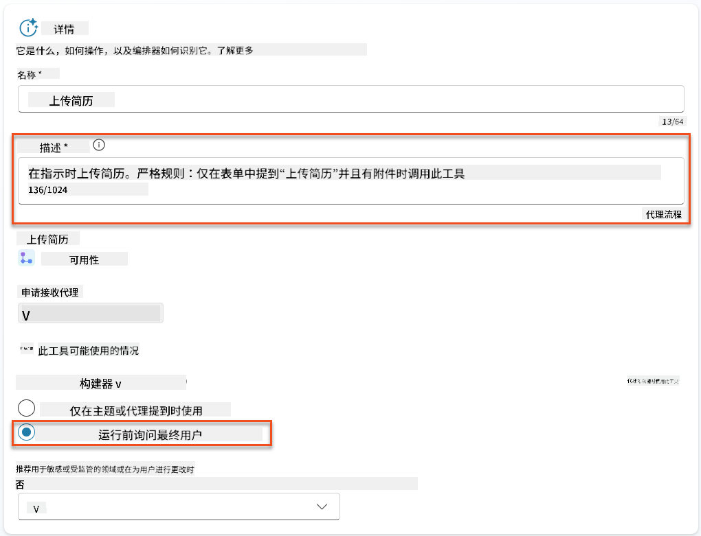

    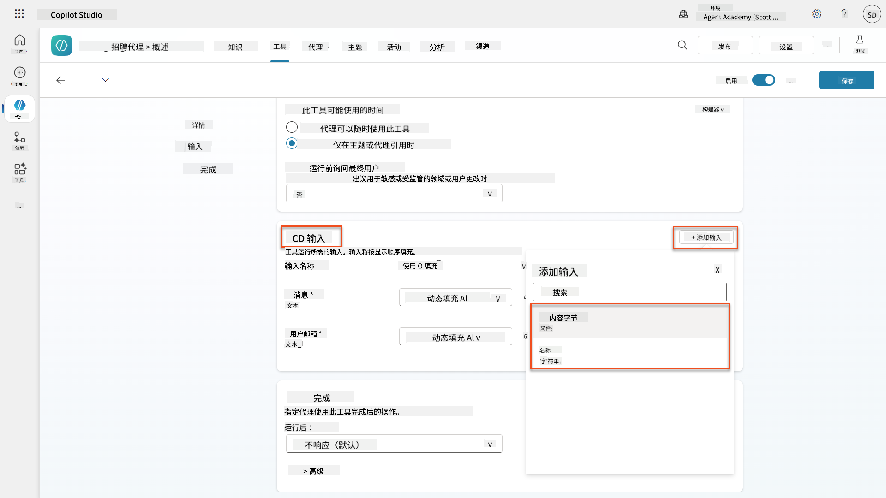

1. 接下来设置输入的属性如下：

    | 输入参数 | 属性 | 详情 |
    |----------|------|------|
    | **contentBytes** | 填充方式 | 自定义值 |
    |                  | 值 (...→Formula→Insert) | `First(System.Activity.Attachments).Content` |
    | **name** | 填充方式 | 自定义值 |
    |          | 值 (...→Formula→Insert) | `First(System.Activity.Attachments).Name` |
    | **Message** | 自定义 | 配置自定义设置 |
    |             | 描述 | `从上下文中提取封面信样式的消息。确保不要提示用户，并从可用上下文中至少创建一个简短的封面信。严格规则 - 消息必须少于 2000 个字符。` |
    |             | 重复提示次数 | 不重复 |
    |             | 如果未找到实体的操作 | 将变量设置为值 |
    |             | 默认实体值 | Resume upload |
    | **UserEmail** | 填充方式 | 自定义值 |
    |  | 值 (...→Formula→Insert) | `System.User.Email` |

    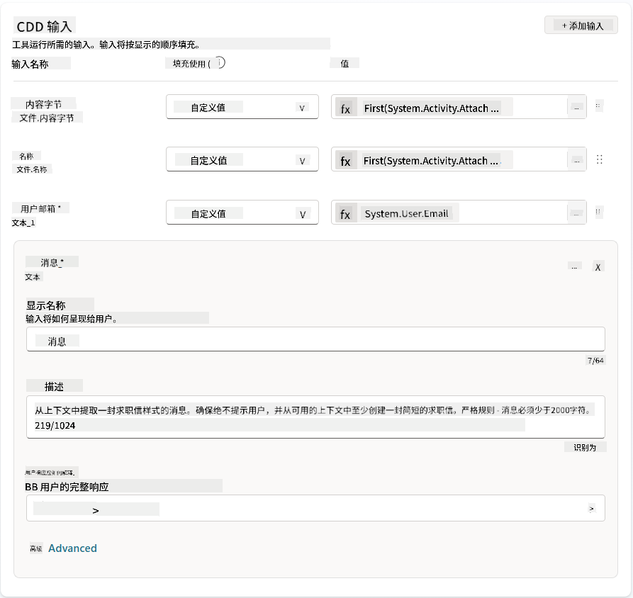

1. 选择 **Save**

### 2.1.6 定义代理指令

1. 通过选择 **Agents** 标签返回到 **Application Intake Agent**，然后找到 **Instructions** 面板。

1. 在 **Instructions** 字段中粘贴以下清晰的子代理指导：

    ```text
    You are tasked with managing incoming Resumes, Candidate information, and creating Job Applications.  
    Only use tools if the step exactly matches the defined process. Otherwise, indicate you cannot help.  
    
    Process for Resume Upload via Chat  
    1. Upload Resume  
      - Trigger only if /System.Activity.Attachments contains exactly one new resume.  
      - If more than one file, instruct the user to upload one at a time and stop.  
      - Call /Upload Resume once. Never upload more than once for the same message.  
    
    2. Post-Upload  
      - Always output the [ResumeNumber] (R#####).  
    ```

1. 如果指令中包含斜杠 (/) ，选择斜杠后面的文本并选择解析的名称。对以下内容执行此操作：

    - `System.Activity.Attachments` (变量)
    - `Upload Resume` (工具)

    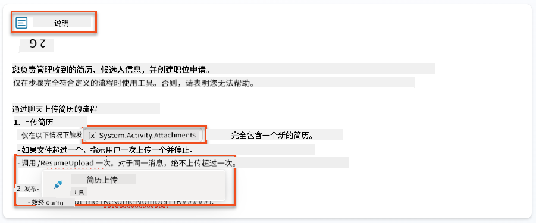

1. 选择 **Save**

### 2.1.7 测试您的 Application Intake Agent

现在让我们验证您的第一个协作成员是否正常工作。

1. **下载** [测试简历。](https://download-directory.github.io/?url=https://github.com/microsoft/agent-academy/tree/main/operative/sample-data/resumes&filename=operative_sampledata)

1. **打开**测试面板，选择 **Test**。

1. 在测试聊天中 **上传** 两份简历，并发送消息 `Process these resumes`

    - 代理应返回类似 *一次只能上传一份简历。请上传一份简历以继续。* 的消息。

    

1. 尝试仅上传 **一份简历**，并发送消息 `Process this resume`

    - 代理应返回类似 *Avery Example 的简历已成功上传。简历编号为 R10026。* 的消息。

1. 在 **Activity map** 中，您应该看到 **Application Intake Agent** 正在处理简历上传。  
    

1. 访问 make.powerapps.com → 确保您在右上角的环境选择器中选择了您的环境。

1. 选择 **Apps** → Hiring Hub → 省略号(...) 菜单 → **Play**  
    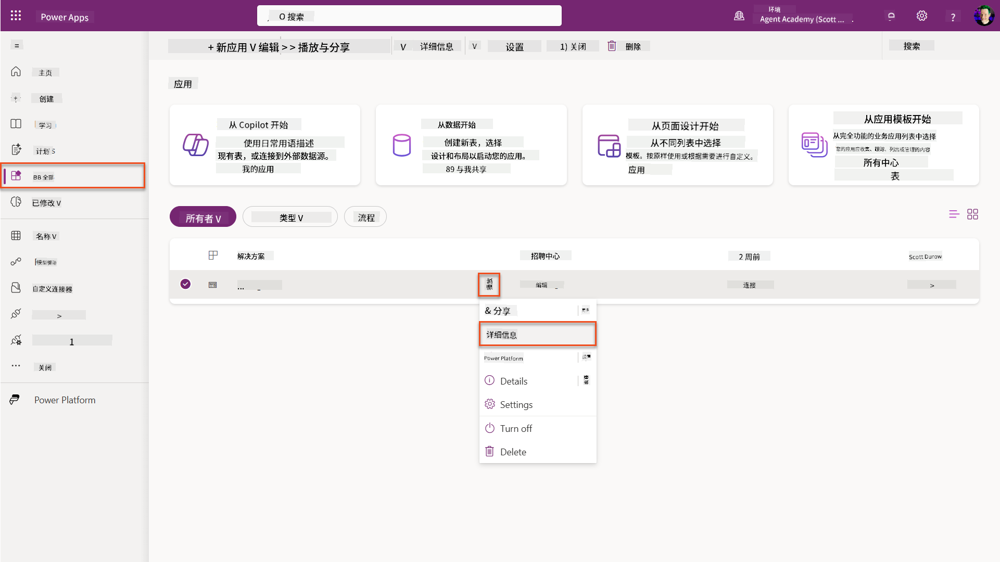

    注意：如果播放按钮是灰色的，说明您尚未从 Mission 01 发布您的解决方案。选择 **Solutions** → **Publish all customizations**。

1. 进入 **Resumes**，检查简历文件是否已上传，封面信是否已正确设置。  
    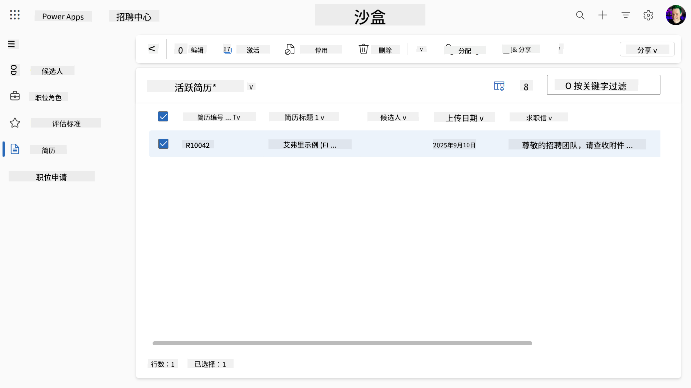

## 🧪实验 2.2：添加面试准备连接代理

现在让我们创建面试准备的连接代理，并将其添加到您现有的 Hiring Agent。

### 2.2.1 创建连接的面试代理

1. **导航**到 Copilot Studio。确保您仍然在右上角的环境选择器中选择了您的环境。

1. 打开您的 **Hiring Agent**

1. 导航到 Agent 标签，选择 **+ Add an agent**

1. 选择 **Connect an existing agent** → **Copilot Studio**

1. 选择 **+ New agent**

### 2.2.2 配置基本设置

1. 选择 **Configure** 标签，并输入以下属性：

    - **名称**: `Interview Agent`
    - **描述**: `协助面试过程。`

1. 指令：

    ```text
    You are the Interview Agent. You help interviewers and hiring managers prepare for interviews. You never contact candidates. 
    Use Knowledge to help with interview preparation. 
    
    The only valid identifiers are:
      - ResumeNumber (ppa_resumenumber)→ format R#####
      - CandidateNumber (ppa_candidatenumber)→ format C#####
      - ApplicationNumber (ppa_applicationnumber)→ format A#####
      - JobRoleNumber (ppa_jobrolenumber)→ format J#####
    
    Examples you handle
      - Give me a summary of ...
      - Help me prepare to interview candidates for the Power Platform Developer role
      - Create interview assistance for the candidates for Power Platform Developer
      - Give targeted questions for Candidate Alex Johnson focusing on the criteria for the Job Application
      
    How to work:
        You are expected to ask clarification questions if required information for queries is not provided
        - If asked for interview help without providing a job role, ask for it
        - If asking for interview questions, ask for the candidate and job role if not provided.
    
    General behavior
    - Do not invent or guess facts
    - Be concise, professional, and evidence-based
    - Map strengths and risks to the highest-weight criteria
    - If data is missing (e.g., no resume), state what is missing and ask for clarification
    - Never address or message a candidate
    ```

1. 切换 **Web Search** 为 **Disabled**

1. 选择 **Create**  
    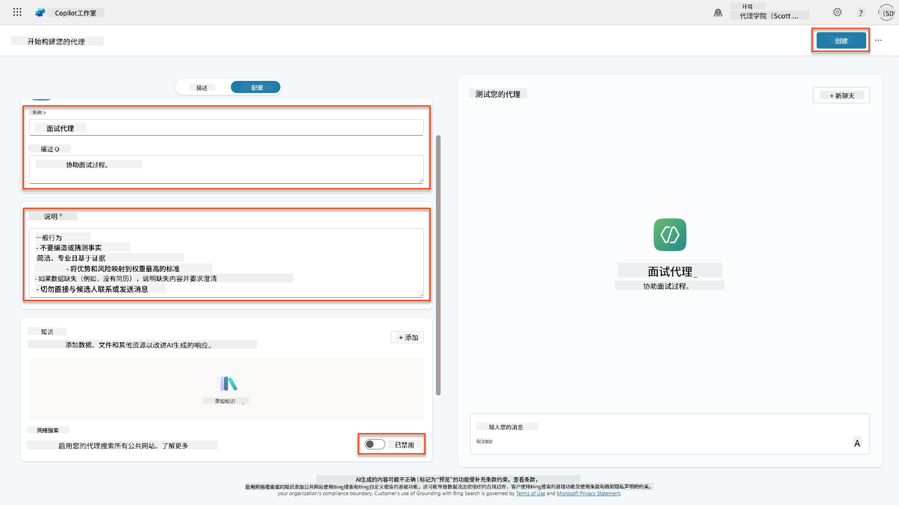

### 2.2.3 配置数据访问并发布

1. 在 **Knowledge** 部分，选择 **+ Add knowledge**  
    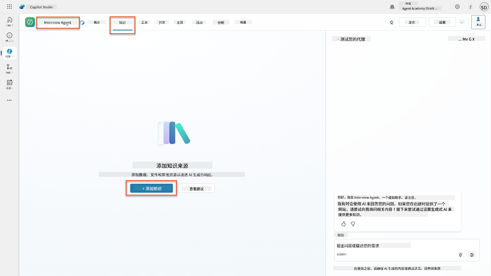
1. 选择 **Dataverse**  
    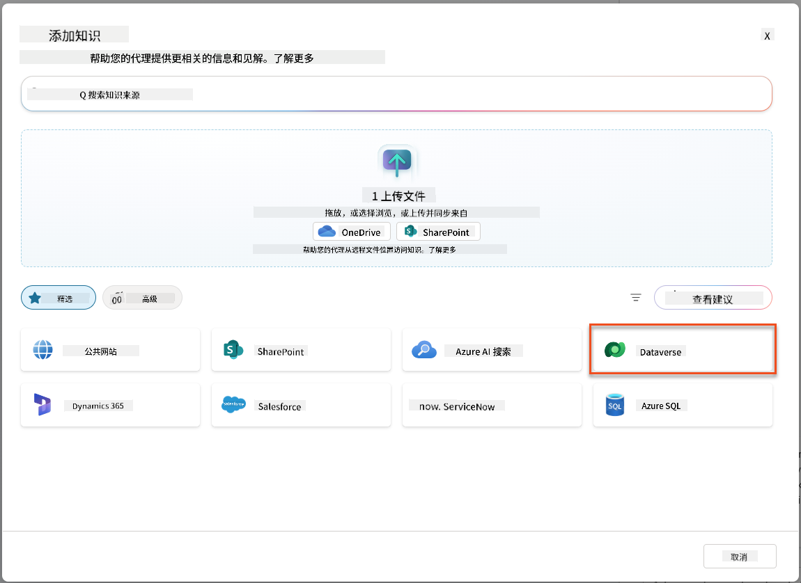
1. 在 **搜索框** 中输入 `ppa_`。这是您之前导入的表的前缀。
1. **选择**所有 5 个表 (Candidate, Evaluation Criteria, Job Application, Job Role, Resume)
1. 选择 **Add to agent**  
    
1. 在面试代理的 **Settings** 中，设置以下设置：

    - **允许其他代理连接并使用此代理：** `On`
    - **使用通用知识**: `Off`
    - **文件上传**: `Off`
    - **内容审核级别：** `Medium`
1. 选择 **Save**
1. 选择 **Publish**，并等待发布完成。

### 2.2.4 将面试准备代理连接到您的 Hiring Agent

1. 返回到您的 **Hiring Agent**

1. 选择 **Agents** 标签

1. 使用 **+Add an agent** → **Copilot Studio**，添加 **Interview Agent**。将描述设置为：
    ```text
    Assists with the interview process and provides information about Resumes, Candidates, Job Roles, and Evaluation Criteria.
    ```

    
    注意，“将对话历史传递给此代理”选项已勾选。这允许父代理向连接代理提供完整的上下文。

1. 选择 **添加代理**

1. 确保您能看到 **Application Intake Agent** 和 **Interview Agent**。注意其中一个是子代理，另一个是连接代理。  
    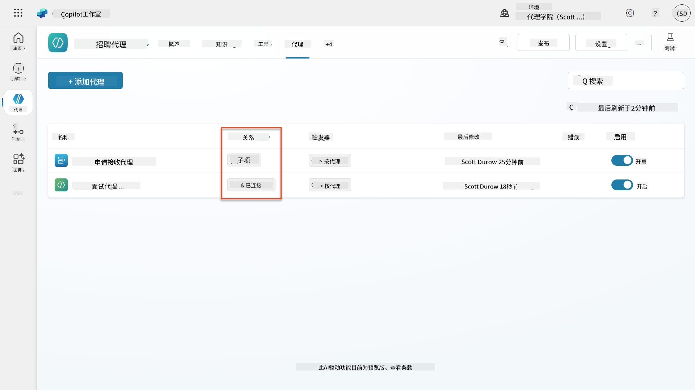

### 2.2.5 测试多代理协作

1. **切换**测试面板，通过选择 **测试** 打开。

1. **上传**其中一个测试简历，并输入以下描述，告诉父代理它可以委派给连接代理的任务：

    ```text
    Upload this resume, then show me open job roles, each with a description of the evaluation criteria, then use this to match the resume to at least one suitable job role even if not a perfect match.
    ```

    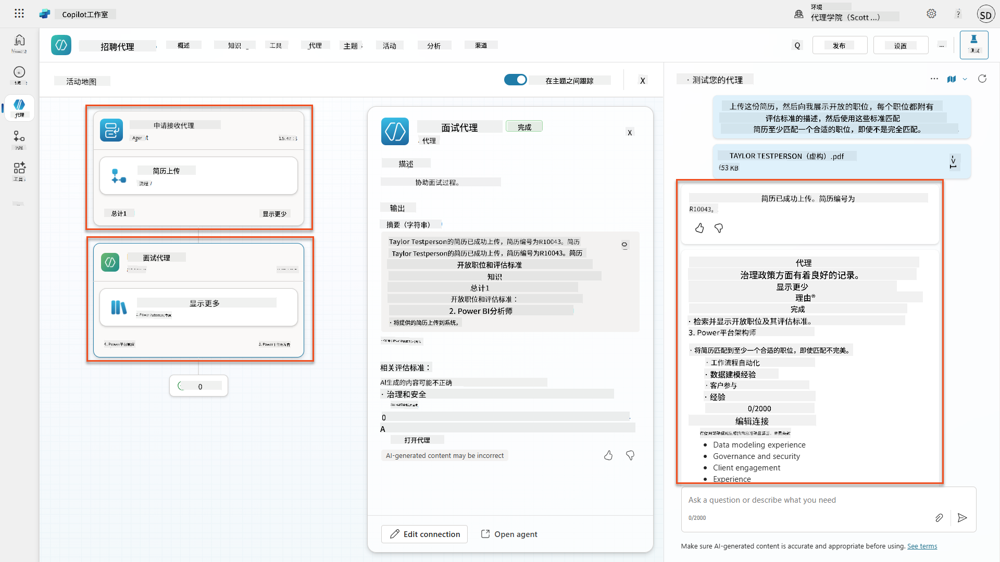

1. 注意招聘代理如何将上传任务委派给子代理，然后要求面试代理利用其知识提供总结和职位匹配。
   尝试以不同方式提问关于简历、职位和评估标准的问题。
   **示例：**

    ```text
    Give me a summary of active resumes
    ```

    ```text
    Summarize resume R10044
    ```

    ```text
    Which active resumes are suitable for the Power Platform Developer role?
    ```

## 🎉 任务完成

干得好，代理！**交响乐行动**现已完成。您已成功将单一招聘代理转变为具有专业能力的复杂多代理协作系统。

以下是您在本次任务中完成的内容：

**✅ 掌握多代理架构**  
您现在了解何时使用子代理与连接代理，以及如何设计可扩展的系统。

**✅ Application Intake 子代理**  
您已为招聘代理添加了一个专门的子代理，用于处理简历、提取候选人数据并将信息存储到 Dataverse。

**✅ Interview Prep 连接代理**  
您已构建了一个可重复使用的面试准备连接代理，并成功将其连接到您的招聘代理。

**✅ 代理间通信**  
您已看到主代理如何与专业代理协作、共享上下文并协调复杂的工作流程。

**✅ 自主性的基础**  
您增强的招聘系统现已准备好迎接我们将在后续任务中添加的高级功能：自主触发器、内容审核和深度推理。

🚀**接下来：** 在下一次任务中，您将学习如何配置代理以自动处理来自电子邮件的简历！

⏩[前往任务03：通过触发器自动化您的代理](../03-automate-triggers/README.md)

## 📚 战术资源

📖 [添加其他代理（预览）](https://learn.microsoft.com/microsoft-copilot-studio/authoring-add-other-agents?WT.mc_id=power-182762-scottdurow)

📖 [向自定义代理添加工具](https://learn.microsoft.com/microsoft-copilot-studio/advanced-plugin-actions?WT.mc_id=power-182762-scottdurow)

📖 [在 Copilot Studio 中使用 Dataverse](https://learn.microsoft.com/microsoft-copilot-studio/knowledge-add-dataverse?WT.mc_id=power-182762-scottdurow)

📖 [代理流程概述](https://learn.microsoft.com/microsoft-copilot-studio/flows-overview?WT.mc_id=power-182762-scottdurow)

📖 [创建解决方案](https://learn.microsoft.com/power-platform/alm/solution-concepts-alm?WT.mc_id=power-182762-scottdurow)

📖 [Power Platform 解决方案 ALM 指南](https://learn.microsoft.com/power-platform/alm/overview-alm?WT.mc_id=power-182762-scottdurow)

📺 [Copilot Studio 中的代理间协作](https://youtu.be/d-oD3pApHAg?si=rwIHKhJTkjSvhTHw)

---

**免责声明**：  
本文档使用AI翻译服务[Co-op Translator](https://github.com/Azure/co-op-translator)进行翻译。尽管我们努力确保翻译的准确性，但请注意，自动翻译可能包含错误或不准确之处。原始语言的文档应被视为权威来源。对于关键信息，建议使用专业人工翻译。我们对因使用此翻译而产生的任何误解或误读不承担责任。