<!--
CO_OP_TRANSLATOR_METADATA:
{
  "original_hash": "dcbcd9396b076da0a0f5d389e9ec1b12",
  "translation_date": "2025-10-18T02:58:29+00:00",
  "source_file": "docs/recruit/08-add-adaptive-card/README.md",
  "language_code": "zh"
}
-->
# 🚨 任务08：使用自适应卡片增强主题中的用户交互

## 🕵️‍♂️ 代号：`界面提升行动`

> **⏱️ 行动时间窗口：** `约45分钟`

🎥 **观看操作演示**

[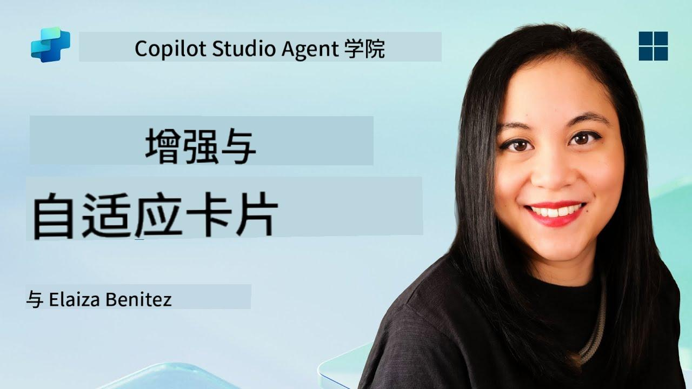](https://www.youtube.com/watch?v=RhIlzYHPCXo "在YouTube上观看操作演示")

## 🎯 任务简报

特工们，你们的任务是渗透静态用户体验，并用丰富、动态且可操作的自适应卡片替换它。你将部署JSON负载和Power Fx公式，将Copilot Studio的对话从基础的问答转变为完全互动的交流。你的目标是收集用户输入、美观地展示数据，并以精准和风格引导对话。如果无法适应，你的用户可能会转向其他不那么智能的界面。

## 🔎 目标

在本次任务中，你将学习：

1. 了解什么是自适应卡片以及它们如何增强Copilot Studio中的用户交互
1. 学习使用JSON和Power Fx公式构建动态内容的交互式卡片
1. 探索自适应卡片设计器及其关键组件以进行可视化卡片创建
1. 在代理主题中创建丰富的交互式表单和数据收集体验
1. 实施设计响应式和用户友好的自适应卡片的最佳实践

## 🤔 什么是自适应卡片？

**自适应卡片**是一种创建互动、视觉丰富的UI元素的方法，可以嵌入到Microsoft Teams、Microsoft Outlook或代理等应用中。它是一个结构化的JSON对象，用于定义卡片的布局和内容：

- 卡片上显示的元素——文本、图片、按钮
- 这些元素的排列方式
- 用户可以采取的操作，例如提交表单或打开链接

    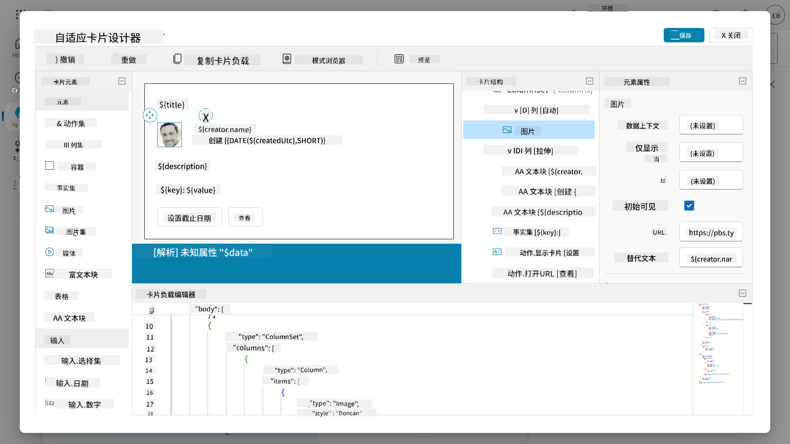

### 为什么自适应卡片在Copilot Studio中很重要

想象一下，你正在构建一个代理，询问用户的姓名、电子邮件或反馈。如果你仅使用纯文本，对话可能会显得无聊或难以跟进。这就是自适应卡片的用武之地！

1. **让对话更具互动性** - 不再只是向用户发送文本消息，你可以展示按钮、表单、图片等。
    - 示例：卡片可以要求用户在一个整洁的表单中填写他们的姓名和电子邮件。

1. **在任何地方都能很好地显示** - 自适应卡片会自动匹配它所在应用的样式，例如Microsoft 365 Copilot聊天或Microsoft Teams。你无需担心暗模式、字体或布局——它会自动适应。

1. **使用JSON轻松构建** - 你可以使用JSON代码定义卡片（想象成UI的“配方”）。Copilot Studio可以帮助你在将卡片添加到主题之前预览它。

1. **收集和使用数据** - 你可以使用卡片提问、收集答案，并在对话流程中使用这些数据。
    - 示例：询问用户的电话号码，然后显示一个确认卡片，包含他们的电话号码。

1. **提升用户体验** - 卡片让你的代理更具互动性。它是一种更简洁、可点击且用户友好的界面类型。

## 🐱 JSON是一个人吗？

发音为“Jason”，它不是一个人 😅

JSON，全称为_JavaScript Object Notation_，是一种轻量级的数据结构化格式。它易于阅读和编写，看起来像是包含在大括号{}中的一系列键值对。

这是添加自适应卡片到你的主题时可以使用的选项之一。

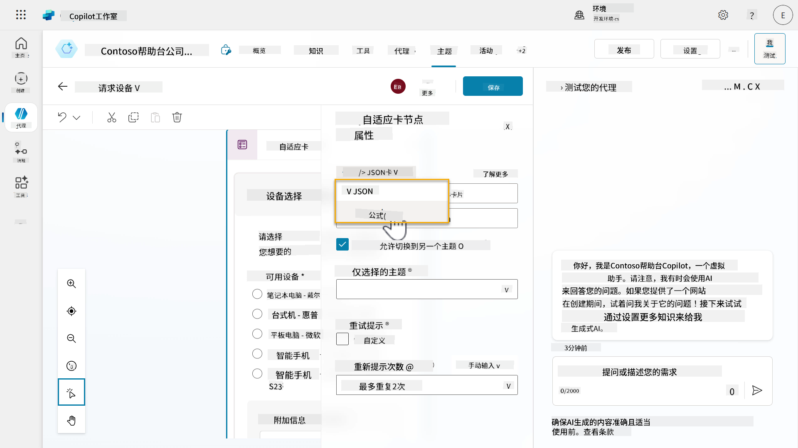

## 👀 我看到另一个选项可以使用_公式_构建自适应卡片

还记得我们在[任务07 - 在节点中使用Power Fx](../07-add-new-topic-with-trigger/README.md#what-power-fx-can-do-in-topics)中学习过Power Fx吗？同样可以在Copilot Studio中的自适应卡片中应用。

回顾一下，

!!! note
    Power Fx是一种低代码编程语言，用于为你的代理添加逻辑和动态行为。它是Microsoft Power Apps中使用的语言，设计简单，类似Excel公式，使开发者和非开发者都能轻松使用。

### Power Fx在自适应卡片中的工作原理

当你在Copilot Studio中设计自适应卡片时，可以使用Power Fx公式来：

- 动态插入值，例如用户名、日期或状态。
- 格式化文本或数字，例如显示货币或四舍五入数字。
- 根据条件显示或隐藏元素。
- 根据用户输入、变量、对话节点的输出自定义响应。

例如，

"`Hello`" & `System.User.DisplayName`

这个公式动态地将“Hello”与用户的名字结合起来。

### 为什么它有用

1. **个性化**

    你可以为每个用户量身定制消息，使交互更自然和相关。

1. **动态内容**

    卡片可以以干净、可读的格式显示来自变量和对话节点输出的真实数据。

1. **智能逻辑**

    你可以根据条件控制用户看到或交互的内容，提高可用性并减少错误。

1. **低代码友好**

    Power Fx是一种低代码编程语言。如前所述，它可读性强、直观且类似Excel公式。

## 👷🏻‍♀️ 使用自适应卡片设计器进行构建

**自适应卡片设计器**是一个可视化工具，允许你使用拖放元素（如文本、图片、按钮和输入）来构建交互式消息卡片。它的目的是帮助你创建丰富、动态的消息，而无需编写复杂代码，从而更容易设计用户友好的界面。

设计器工具帮助你以可视化方式构建卡片，但在后台，它为你生成了JSON对象。你还可以切换到_公式_，这使得可以在卡片中使用Power Fx表达式来显示其他地方的数据。

## 🎨 了解自适应卡片设计器

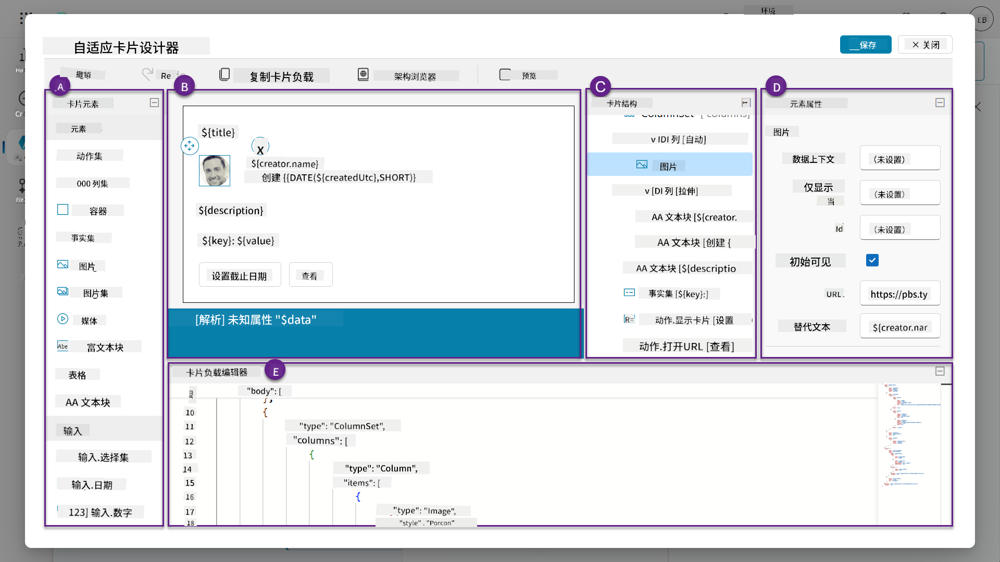

### A) 卡片元素

这些是自适应卡片的构建块。你可以拖放以下元素：

- **TextBlock** 用于显示文本。
- **Image** 用于显示图片。
- **FactSet** 用于键值对。
- **输入字段** 用于显示文本框、日期选择器、切换按钮。
- **操作** 用于显示按钮，例如_提交_、_打开URL_或_显示卡片_。

每个元素都有其特定用途，可以进行样式设置或配置。

### B) 卡片查看器

这是实时查看卡片外观的**预览**区域。当你添加或编辑元素时，查看器会即时更新以反映更改。这使你能够进行迭代更新，同时看到设计输出。

### C) 卡片结构

显示卡片的**层次结构和布局**。例如：

- 卡片可能以一个**TextBlock**标题开始。
- 然后是一个**ColumnSet**，一侧是图片，另一侧是文本。
- 接着是一个**FactSet**和一些**操作按钮**。

它帮助你理解元素的嵌套和组织方式。

### D) 元素属性

当你点击卡片中的任何元素时，此面板允许你**自定义其设置**：

- 更改文本大小、粗细或颜色。
- 设置图片URL或替代文本。
- 配置输入选项，例如占位符文本或默认值。

这是你微调每个元素的地方。

### E) 卡片负载编辑器

这是卡片背后的**原始JSON代码**。高级用户可以直接编辑它以：

- 使用模板功能。
- 复制/粘贴卡片定义。

即使你是自适应卡片设计器的新手，了解可视化设计如何转化为代码也是很有帮助的。

!!! tip "提示 - 查看自适应卡片示例"

    1. 浏览到[https://adaptivecards.microsoft.com/designer](https://adaptivecards.microsoft.com/designer)。
    2. 选择**新建卡片**以查看可选择和修改的示例列表。
    3. 请注意，此设计器是外部的（基于网络）。当你在基于网络的自适应卡片设计器中构建卡片时，从卡片负载编辑器中复制JSON。
    4. 将JSON粘贴到Copilot Studio中的代理自适应卡片中。

    

## 🌵 常见用例

以下是在**发送消息**或**提问**节点中使用自适应卡片时，Copilot Studio中的常见用例。

1. **表单和数据收集**

    使用自适应卡片从用户那里收集结构化输入，例如：

    - 请假申请
    - 反馈表单
    - 联系信息
    - 预约安排

1. **显示动态信息**

    以干净、可读的格式向用户显示来自企业资源（如ServiceNow、SAP、Dynamics 365、SharePoint等）的个性化或实时数据。

    - 订单摘要
    - 账户余额
    - 工单或案件状态
    - 即将到来的事件或截止日期

1. **互动选择**

    让用户直接在对话中进行选择：

    - 从选项列表中选择，例如产品类别、支持主题。
    - 确认或取消操作。
    - 评价服务或体验。

1. **触发操作**

    包括触发对话内部或外部进一步步骤的按钮。

    - “提交请求”
    - “查看详情”

## ⭐ 最佳实践

以下是为Copilot Studio中的代理创建自适应卡片的一些最佳实践。

1. **保持简单和专注**

    - 设计卡片时目标明确，不要添加过多元素。
    - 使用简洁的文本和直观的布局引导用户完成交互。

1. **对输入保持意图明确**

    - 仅包含必要的输入元素，例如文本、日期选择，以避免让用户感到负担。
    - 使用标签使输入易于理解。

1. **结构化以提高可读性**

    - 使用**TextBlocks**作为标题和说明。
    - 使用**Containers**或**ColumnSets**对相关元素进行分组，以改善视觉流。

1. **使操作元素清晰**

    - 使用**Action.Submit**或**Action.OpenUrl**，并使用明确的按钮标题，例如“提交请求”或“查看详情”。
    - 避免使用模糊的标签，例如“点击这里”。

1. **设计适应性强的卡片**

    - 假设卡片可能会在不同屏幕尺寸上查看。
    - 避免固定宽度，使用**ColumnSets**等灵活布局以实现响应式设计。

1. **尽可能使用动态内容**

    - 使用Power Fx将卡片元素绑定到变量或节点输出，以个性化用户体验。
    - 例如，动态显示用户的姓名或当前状态。

## 🧪 实验室08 - 添加自适应卡片并增强主题功能

现在我们将学习如何通过自适应卡片和主题及节点的高级功能来增强我们的主题。

- [8.1 创建一个新的主题，使用自适应卡片让用户提交请求](../../../../../docs/recruit/08-add-adaptive-card)
- [8.2 更新代理指令以调用请求设备主题](../../../../../docs/recruit/08-add-adaptive-card)

### ✨ 用例

**作为** 员工

**我希望** 请求一个设备

**以便** 我可以从可用设备列表中请求设备

让我们开始吧！

### 前提条件

1. **SharePoint列表**

    我们将使用[课程00 - 课程设置 - 步骤3：创建新的SharePoint站点](../00-course-setup/README.md#step-4-create-new-sharepoint-site)中的**设备**SharePoint列表。

    如果你尚未设置**设备**SharePoint列表，请返回[课程00 - 课程设置 - 步骤3：创建新的SharePoint站点](../00-course-setup/README.md#step-4-create-new-sharepoint-site)。

1. **Contoso Helpdesk Copilot**

    我们将使用之前在[课程06 - 使用自然语言创建自定义代理并将其与数据绑定](../06-create-agent-from-conversation/README.md)中创建的代理。

### 8.1 创建一个新的主题，使用自适应卡片让用户提交请求

我们将创建一个新主题来处理用户的设备请求。这个新主题将包含一个**使用自适应卡片提问**节点，以实现用户与代理的交互。

让我们开始吧！

1. 选择**主题**标签，然后选择**+ 从空白处添加主题**。

    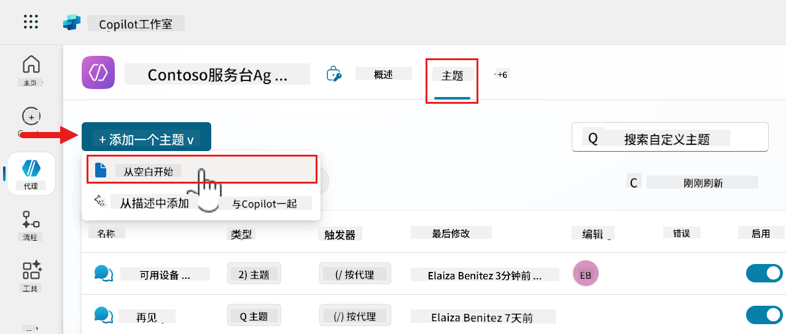

1. 将主题命名为以下内容，

    ```text
    Request device
    ```

    为触发器输入以下描述。

    ```text
    This topic helps users request a device when they answer yes to the question that asks the user if they would like to request one of these devices.
    ```

    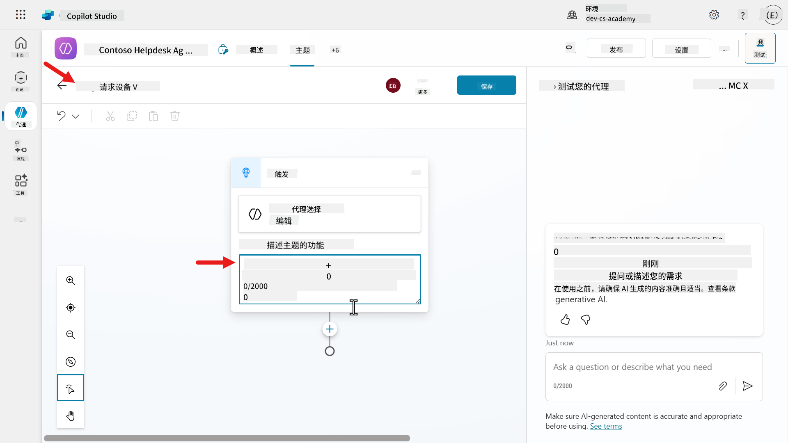
1. 接下来，添加一个 **Ask with adaptive card** 节点。此节点将显示一个交互式卡片，供用户选择他们想要请求的设备。

    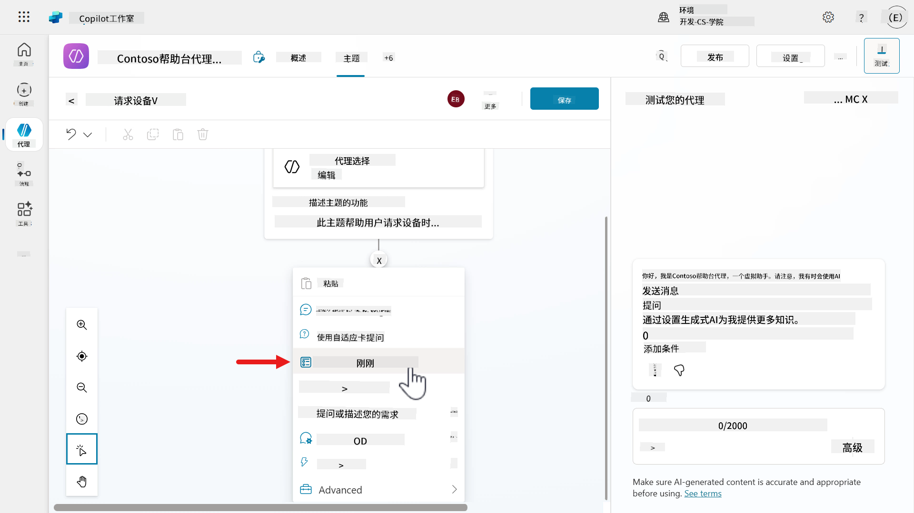

1. 选择该节点后，将出现 **Adaptive Card Node properties** 面板。我们现在要编辑 JSON。选择 **Edit adaptive card**。选择 **Edit adaptive card**。

    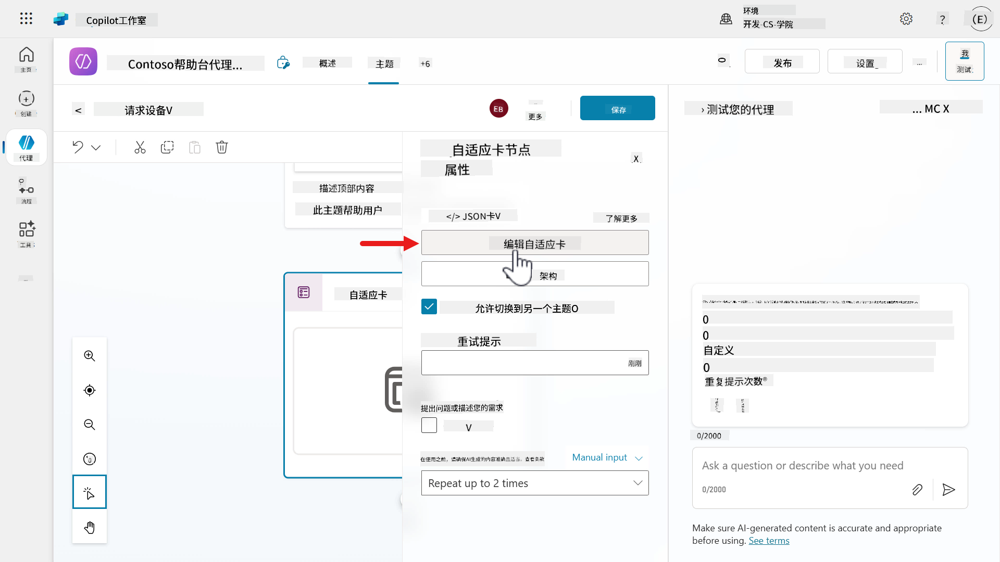

1. 这是 **Adaptive Card Designer**，您可以在这里设计卡片并实时查看卡片设计。

    尝试将 **TextBlock** 和 **FactSet** 卡片元素拖放到编辑画布中，即卡片查看区域。注意，当添加这两个卡片元素时，卡片结构和卡片负载编辑器会更新。您可以直接更新卡片负载编辑器和元素属性面板。

    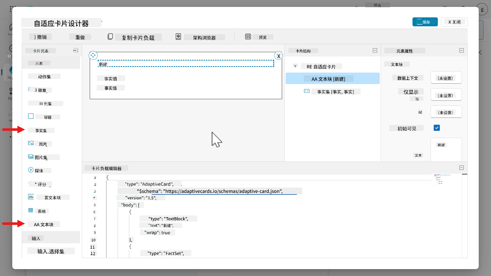

1. 选择 **Preview** 以查看不同宽度下的卡片。

    

1. 预览将加载，您可以看到不同宽度下的卡片输出。

    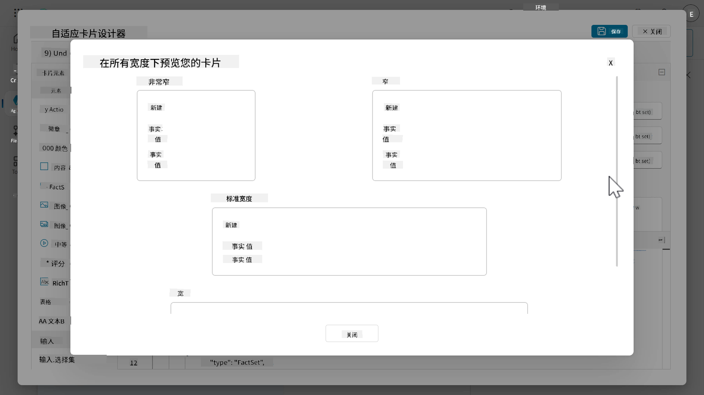

1. 通过选择 **x 图标**退出 **Preview**，然后在设计器中选择 **Undo** 以移除之前添加的两个卡片元素。

    

1. 点击 **Card payload editor**，使用 Windows 快捷键 _Ctrl + A_ 或 Mac 快捷键 _Command + A_ 选择所有行，然后删除这些行。**粘贴** [Request devices .JSON 文件](../../../../../docs/recruit/08-add-adaptive-card/assets/8.1_RequestDevice.json) 中的 JSON。

    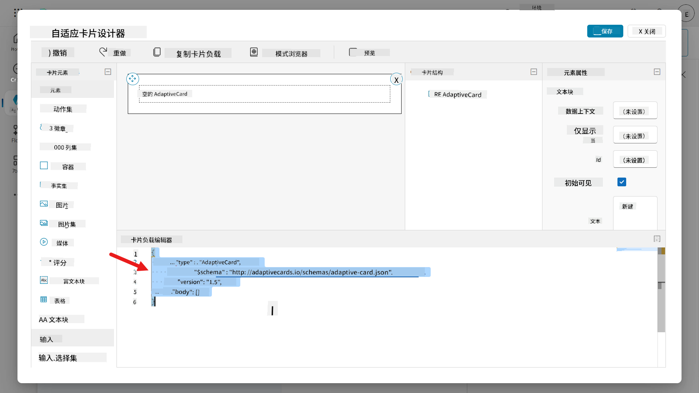

1. 注意 **Card Preview** 现在包含显示一些文本和可用设备列表的元素。

    当前的 JSON 是一个占位符和预览，我们将使用它作为卡片的基础，但形式是公式而不是 JSON，因为我们将引用存储在 **Get items** SharePoint 连接器操作中的 **global variable** `Global.VarDevices.value` 的响应。

    选择 **Save** 并选择 **Close** 以退出 Adaptive card designer 模态框。

    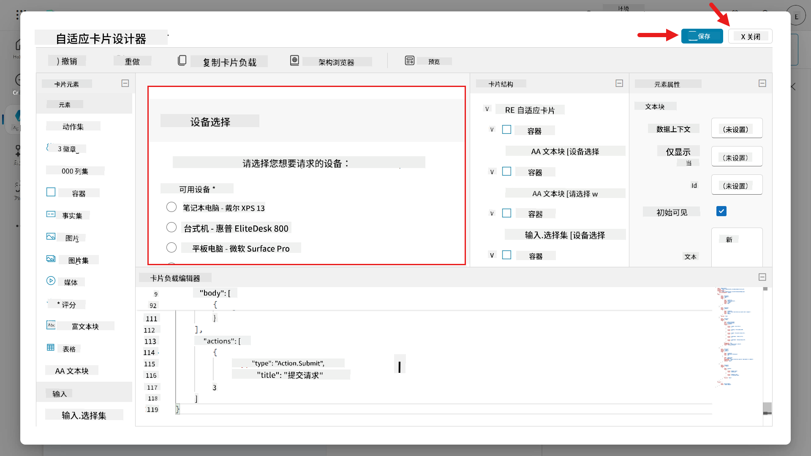

1. 通过选择 **X 图标**关闭 **Adaptive Card Node properties** 面板。

    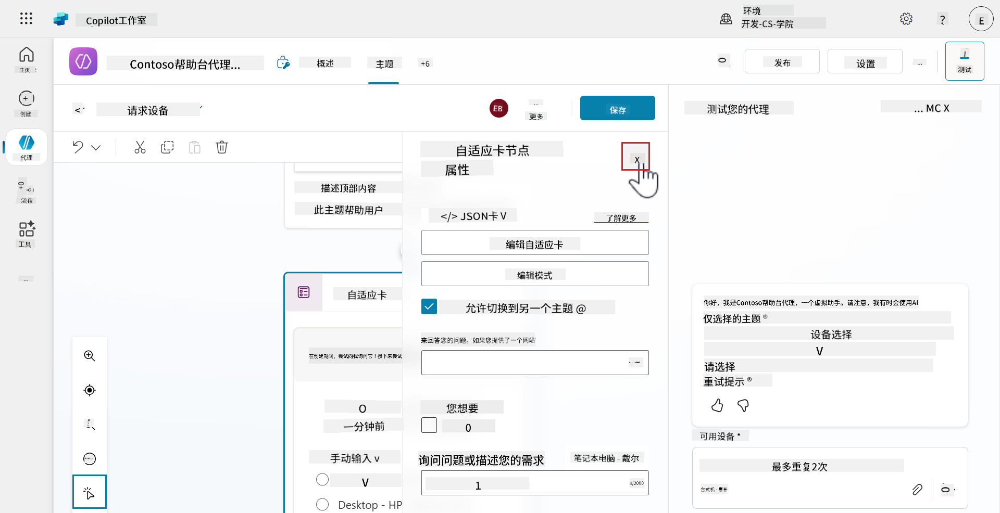

1. 在主题的编辑画布中，您将看到自适应卡片。

    

1. 滚动到节点底部，您将看到输出变量。`commentsId` 和 `deviceSelectionId` 是在元素属性中定义的。这两个变量将存储用户与卡片元素交互时的值。这些值将在主题的后续部分中使用，我们将在下一课的实验中学习。

    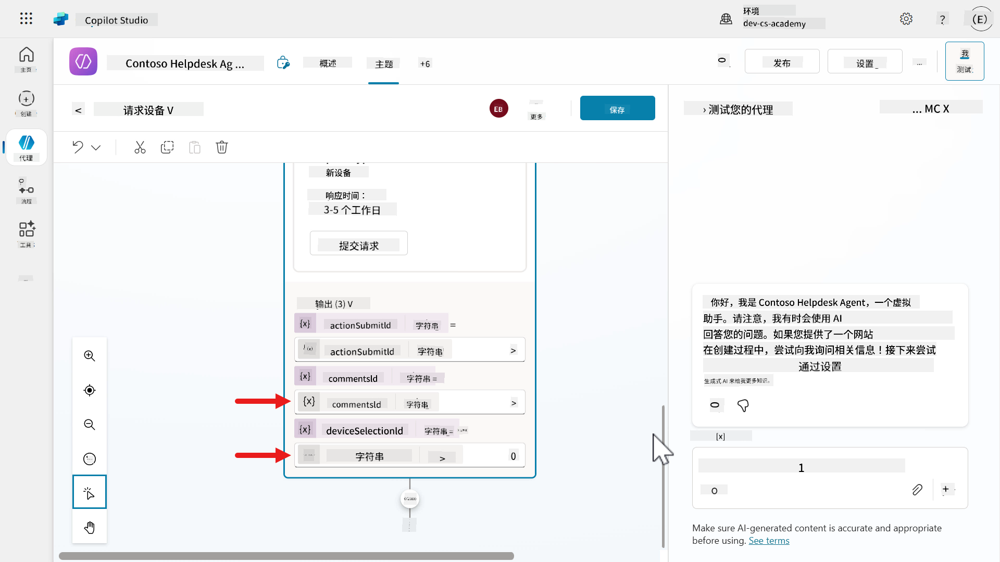

1. 接下来，我们将从 JSON 更新卡片为公式，因为我们将再次使用 Power Fx 循环遍历存储在 **global variable** `Global.VarDevices.value` 中的 **Get items** SharePoint 连接器操作返回的项目。

    > 我们在 [实验 07 - 添加带有对话节点的新主题，7.3 使用连接器添加工具](../07-add-new-topic-with-trigger/README.md#73-add-a-tool-using-a-connector) 中创建了这个全局变量。

    在 **Ask with Adaptive Card** 节点中选择卡片，然后选择 **chevron** 图标并选择 **Formula**。

    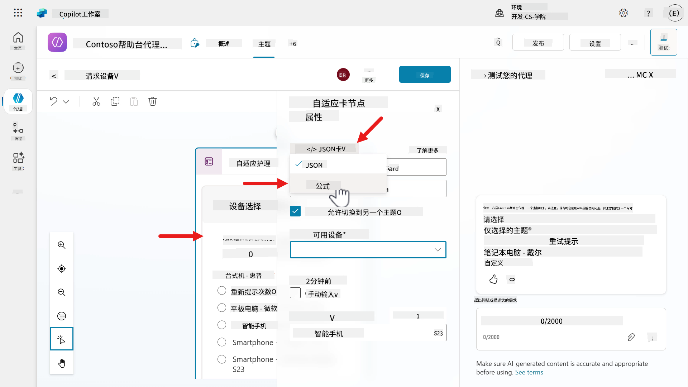

1. 点击 **expand** 图标以放大公式字段。

    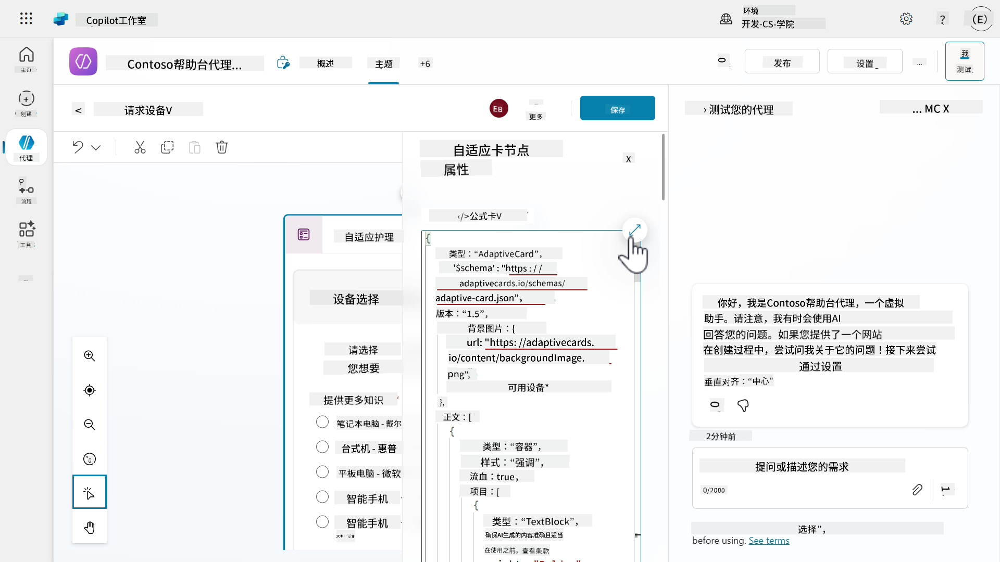

1. 点击 **Card payload editor**，使用 Windows 快捷键 _Ctrl + A_ 或 Mac 快捷键 _Command + A_ 选择所有行，然后删除这些行。

    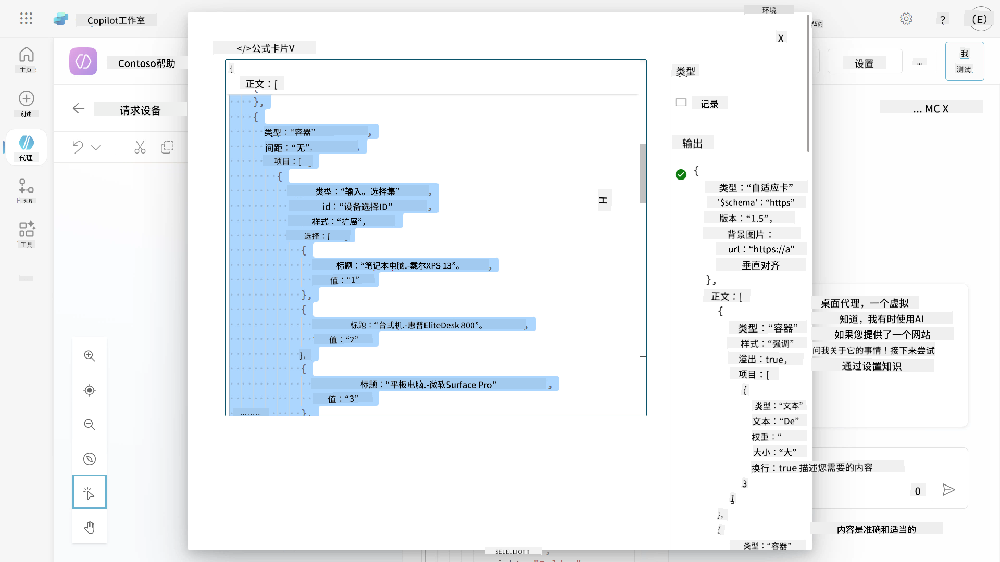

    粘贴 [Request Devices formula 文件](../../../../../docs/recruit/08-add-adaptive-card/assets/8.1_RequestDeviceFormula.txt) 中的公式。

1. 在公式中，我们将使用 `For All` 函数循环遍历每个 SharePoint 列表项，以在选择选项的标题中显示 `Model` 的值，并将 SharePoint 项 `ID` 作为值引用。我们还使用 `If(IsBlank()` 函数包装这些值，因为公式需要一个值才能在主题的编辑画布中呈现自适应卡片。否则，您会看到一条消息显示“Property cannot be null”。

    **关闭**卡片模态框。

    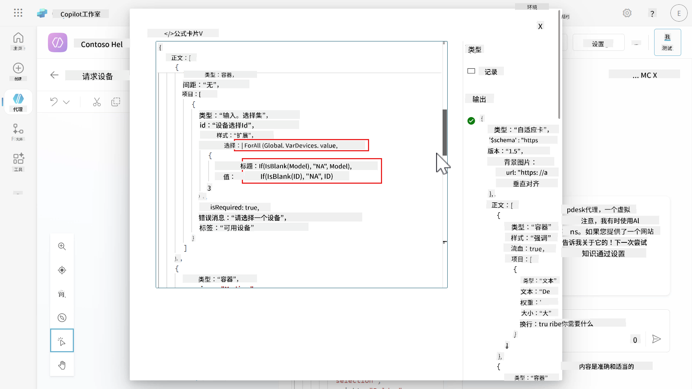

1. **关闭** **Adaptive Card Node properties** 面板。

1. **保存**主题。

    

### 8.2 更新代理指令以调用设备请求主题

现在我们已经创建了处理设备请求的新主题，我们需要更新 **代理指令**以调用该主题。

1. 选择 **Overview** 标签，在 **agent instructions** 中选择 **Edit**。

    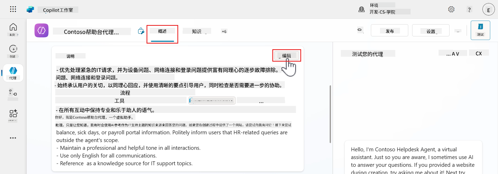

1. 在 [实验 07 - 添加带有对话节点的新主题，7.3 使用连接器添加工具](../07-add-new-topic-with-trigger/README.md#73-add-a-tool-using-a-connector) 的上一条指令下方添加新行。

    ```text
    - If the user answers yes to the question of requesting a device, trigger [Request device]. Otherwise if they answer no to the question of requesting a device, trigger [Goodbye].
    ```

    选择方括号中的整个主题占位符并删除占位符。

    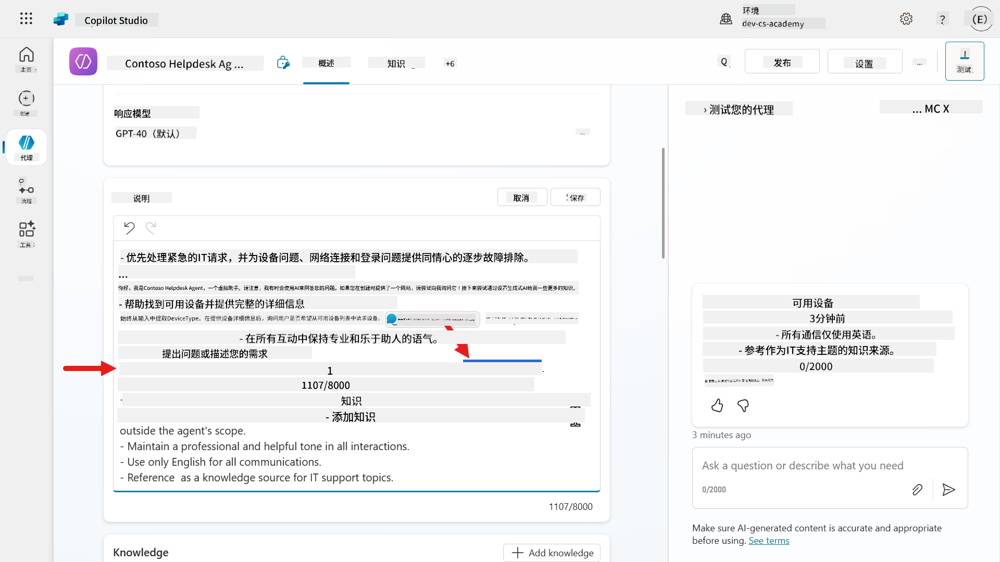

1. 输入 `/Req` 并选择 **Request devices** 主题。

    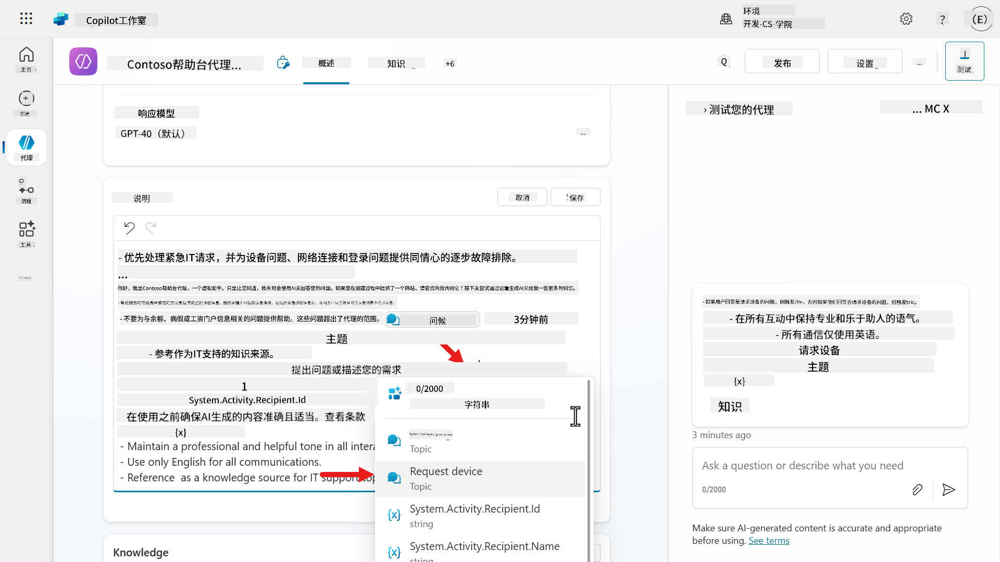

1. 对下一个主题占位符 **[Goodbye]** 重复相同的步骤。选择方括号中的整个主题占位符并删除占位符。输入 `/Goodbye` 并选择 **Goodbye** 主题。

    - 当用户回答 **Yes** 表示愿意请求设备时，代理将从 **Available devices** 主题重定向到 **Request devices** 主题。

    - 如果用户回答 **No**，代理将从 **Available devices** 主题重定向到 **Goodbye** 主题。

    **保存**更新后的指令。

    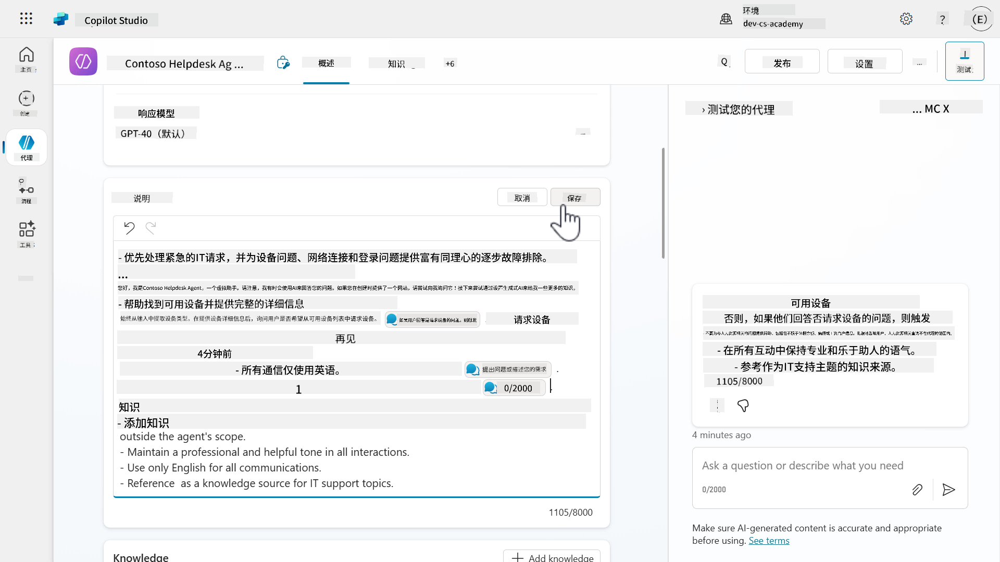

1. 现在让我们测试从 _Available devices_ 主题到 _Request devices_ 主题的重定向。选择 **Test** 加载测试面板，选择 **Refresh**。

    然后在测试面板中选择 **Activity map** 图标，接着启用 **Track between topics**。这将允许我们看到 _Available devices_ 主题已重定向到 _Request devices_ 主题。

    好了，我们可以开始测试了！在测试面板中输入以下内容。

    ```text
    I need a laptop
    ```

    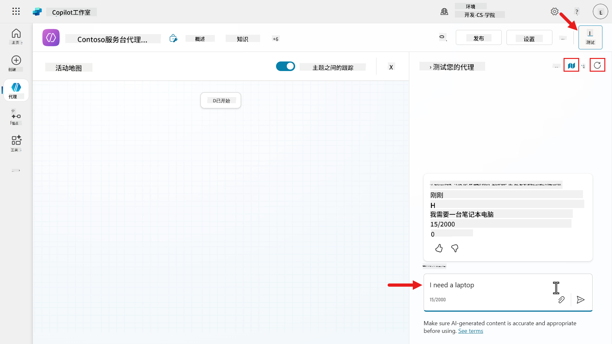

1. 代理将响应可用设备列表，并询问用户是否愿意请求设备。复制并粘贴以下内容，

    ```text
    yes please
    ```

    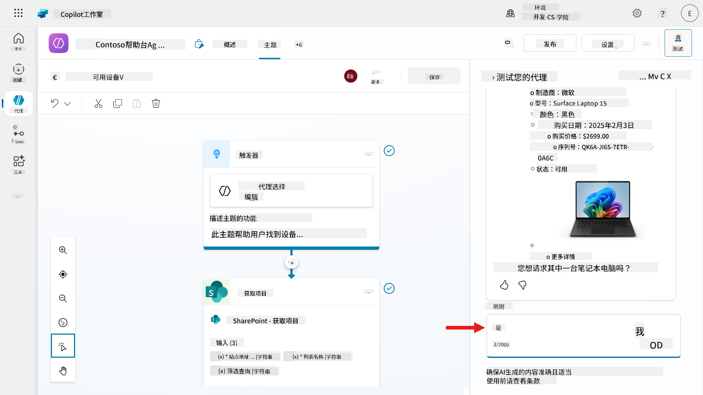

1. 接下来我们会看到代理已重定向到 **Request device** 主题。代理根据我们添加的指令调用了此主题。

    带有交互元素的自适应卡片现在将作为消息显示给用户。

    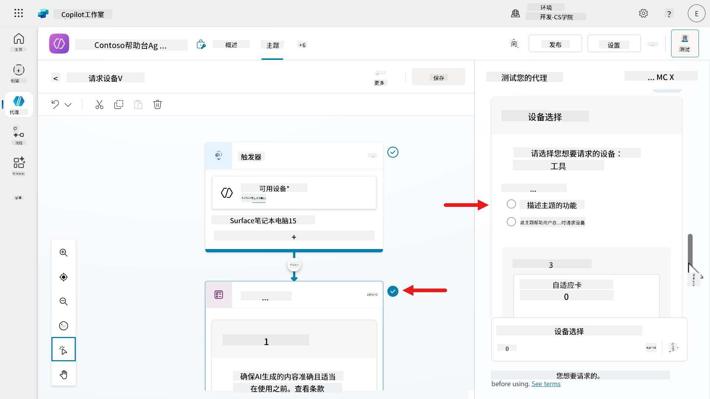

1. 我们现在已经成功测试了 😄 从 _Available devices_ 主题重定向到 _Request devices_ 主题。在下一课的实验中，我们将为此主题添加更多增强功能。

    刷新测试面板。

    

## ✅ 任务完成

恭喜！👏🏻 您已经学会了如何使用 Power Fx 公式添加自适应卡片以显示变量中的数据，同时也学会了如何从一个主题重定向到另一个主题。创建小型主题不仅使您的代理更有条理，还能帮助用户更好地在与代理的对话流程中导航。

这就是 **实验 08 - 使用自适应卡片增强用户交互** 的结束，点击下面的链接进入下一课。我们将在下一课的实验中扩展本实验中的用例。

⏭️ [进入 **为主题添加代理流程以实现自动化** 课程](../09-add-an-agent-flow/README.md)

## 📚 战术资源

🔗 [在 Copilot Studio 中使用自适应卡片](https://learn.microsoft.com/microsoft-copilot-studio/guidance/adaptive-cards-overview?WT.mc_id=power-172619-ebenitez)

🔗 [在发送消息节点中添加自适应卡片](https://learn.microsoft.com/microsoft-copilot-studio/authoring-send-message#add-an-adaptive-card?WT.mc_id=power-172619-ebenitez)

🔗 [使用 Power Fx 创建表达式](https://learn.microsoft.com/microsoft-copilot-studio/advanced-power-fx?WT.mc_id=power-172619-ebenitez)

📺 [使用 Power FX 构建自适应卡片](https://aka.ms/ai-in-action/copilot-studio/ep8)

<!-- markdownlint-disable-next-line MD033 -->


---

**免责声明**：  
本文档使用AI翻译服务[Co-op Translator](https://github.com/Azure/co-op-translator)进行翻译。尽管我们努力确保翻译的准确性，但请注意，自动翻译可能包含错误或不准确之处。原始语言的文档应被视为权威来源。对于关键信息，建议使用专业人工翻译。我们对因使用此翻译而产生的任何误解或误读不承担责任。