<!--
CO_OP_TRANSLATOR_METADATA:
{
  "original_hash": "9dceeba2eae2bb73e328602a060eddab",
  "translation_date": "2025-10-18T02:54:46+00:00",
  "source_file": "docs/recruit/11-publish-your-agent/README.md",
  "language_code": "zh"
}
-->
# 🚨 任务11：发布您的智能代理

## 🕵️‍♂️ 代号：`发布发布发布行动`

> **⏱️ 行动时间窗口：** `~30分钟`  

🎥 **观看操作演示**

[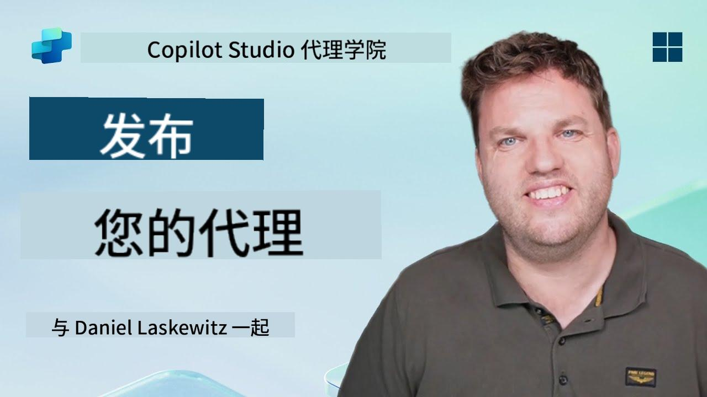](https://www.youtube.com/watch?v=eVZmljhYlSI "在YouTube上观看操作演示")

## 🎯 任务简报

完成了一系列具有挑战性的模块后，智能代理创建者，您现在已经准备好迈出最关键的一步：发布您的智能代理。是时候让您的作品在Microsoft Teams和Microsoft 365 Copilot中为用户所用。

您的智能代理——配备了明确的任务、强大的工具以及关键知识来源——已经准备好为用户服务。通过Microsoft Copilot Studio，您可以部署您的智能代理，让它开始在用户的工作场所提供帮助。

让我们启动您的智能代理吧！

## 🔎 目标

📖 本课程涵盖：

1. 为什么发布您的智能代理很重要
1. 发布智能代理时会发生什么
1. 如何添加渠道（Microsoft Teams和Microsoft 365 Copilot）
1. 如何将智能代理添加到Microsoft Teams
1. 如何让整个组织的用户在Microsoft Teams中使用智能代理

## 🚀 发布智能代理

每次您在Copilot Studio中开发智能代理时，可能会通过添加知识或工具来更新它。当您完成所有更改并经过彻底测试后，就可以准备发布了。发布确保最新的更新上线。如果您更新了智能代理但没有点击发布按钮，这些更新将无法供最终用户使用。

请确保每次想要将更新推送给智能代理的用户时，都点击发布按钮。您的智能代理可能已经添加了多个渠道，当您点击发布时，更新将对所有已添加的渠道生效。

## ⚙️ 配置渠道

渠道决定了用户可以在哪里访问和与您的智能代理互动。发布智能代理后，您可以将其提供给多个渠道。每个渠道可能以不同的方式显示智能代理的内容。

您可以将智能代理添加到以下渠道：

- **Microsoft Teams和Microsoft 365 Copilot** - 让您的智能代理在Teams聊天和会议中，以及Microsoft 365 Copilot体验中可用（[了解更多](https://learn.microsoft.com/microsoft-copilot-studio/publication-add-bot-to-microsoft-teams)）
- **演示网站** - 在Copilot Studio提供的演示网站上测试您的智能代理（[了解更多](https://learn.microsoft.com/microsoft-copilot-studio/publication-connect-bot-to-web-channels)）
- **自定义网站** - 将您的智能代理直接嵌入到您自己的网站中（[了解更多](https://learn.microsoft.com/microsoft-copilot-studio/publication-connect-bot-to-web-channels)）
- **移动应用** - 将您的智能代理集成到自定义移动应用中（[了解更多](https://learn.microsoft.com/microsoft-copilot-studio/publication-connect-bot-to-custom-application)）
- **SharePoint** - 将您的智能代理添加到SharePoint站点，用于文档和站点协助（[了解更多](https://learn.microsoft.com/microsoft-copilot-studio/publication-add-bot-to-sharepoint)）
- **Facebook Messenger** - 通过Facebook的消息平台与用户连接（[了解更多](https://learn.microsoft.com/microsoft-copilot-studio/publication-add-bot-to-facebook)）
- **Power Pages** - 将您的智能代理集成到Power Pages网站中（[了解更多](https://learn.microsoft.com/microsoft-copilot-studio/publication-add-bot-to-power-pages)）
- **Azure Bot Service渠道** - 访问包括Slack、Telegram、Twilio SMS等在内的其他渠道（[了解更多](https://learn.microsoft.com/microsoft-copilot-studio/publication-connect-bot-to-azure-bot-service-channels)）

要添加渠道，请导航到智能代理中的**Channels**选项卡，然后选择您想要配置的渠道。每个渠道都有特定的设置要求，可能需要额外的身份验证或配置步骤。

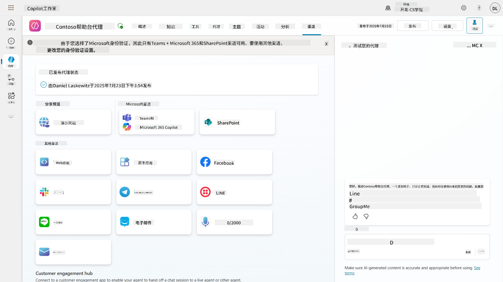

## 📺 渠道体验

不同的渠道有不同的用户体验。在为多个渠道构建智能代理时，请务必了解每个渠道的差异。测试智能代理在多个渠道中的表现是一个很好的策略，以确保它能够实现您的预期。

| 体验                              | 网站          | Teams和Microsoft 365 Copilot           | Facebook                 | Dynamics Omnichannel for Customer Service                   |
| --------------------------------- | ------------- | --------------------------------------- | ------------------------ | ----------------------------------------------------------- |
| [客户满意度调查][1]               | 自适应卡片    | 仅支持文本                              | 仅支持文本               | 仅支持文本                                                  |
| [多选选项][1]                     | 支持          | [支持最多六个（作为主卡）][4]           | [支持最多13个][6]        | [部分支持][8]                                               |
| [Markdown][2]                     | 支持          | [部分支持][5]                           | [部分支持][7]            | [部分支持][9]                                               |
| [欢迎消息][1]                     | 支持          | 支持                                   | 不支持                  | 支持[聊天][10]。其他渠道不支持。                            |
| [Did-You-Mean][3]                 | 支持          | 支持                                   | 支持                    | 支持[Microsoft Teams][11]、[聊天][10]、Facebook以及仅支持文本的渠道（通过[TeleSign][12]和[Twilio][13]的短消息服务（SMS），[WhatsApp][14]、[WeChat][15]和[Twitter][16]）。建议操作以仅文本列表形式呈现；用户必须重新输入选项以响应。 |

[1]: https://learn.microsoft.com/microsoft-copilot-studio/authoring-create-edit-topics  
[2]: https://daringfireball.net/projects/markdown/  
[3]: https://learn.microsoft.com/microsoft-copilot-studio/advanced-ai-features  
[4]: https://learn.microsoft.com/microsoftteams/platform/concepts/cards/cards-reference#hero-card  
[5]: https://learn.microsoft.com/microsoftteams/platform/bots/how-to/format-your-bot-messages#text-only-messages  
[6]: https://developers.facebook.com/docs/messenger-platform/send-messages/quick-replies/  
[7]: https://www.facebook.com/help/147348452522644?helpref=related  
[8]: https://learn.microsoft.com/dynamics365/customer-service/asynchronous-channels#suggested-actions-support  
[9]: https://learn.microsoft.com/dynamics365/customer-service/asynchronous-channels#preview-support-for-formatted-messages  
[10]: https://learn.microsoft.com/dynamics365/customer-service/set-up-chat-widget  
[11]: https://learn.microsoft.com/dynamics365/customer-service/configure-microsoft-teams  
[12]: https://learn.microsoft.com/dynamics365/customer-service/configure-sms-channel  
[13]: https://learn.microsoft.com/dynamics365/customer-service/configure-sms-channel-twilio  
[14]: https://learn.microsoft.com/dynamics365/customer-service/configure-whatsapp-channel  
[15]: https://learn.microsoft.com/dynamics365/customer-service/configure-wechat-channel  
[16]: https://learn.microsoft.com/dynamics365/customer-service/configure-twitter-channel  

> [!NOTE]  
> 以下是一些可以为不同渠道使用不同逻辑的示例。一个示例可以在Power Platform Snippets存储库中找到：  
>  
> Henry Jammes分享了一个示例，展示了如何在渠道为Microsoft Teams时显示不同的自适应卡片。（[示例链接](https://github.com/pnp/powerplatform-snippets/blob/main/copilot-studio/multiple-topics-matched-topic/source/multiple-topics-matched.yaml#L40)）

## 🧪 实验11：将智能代理发布到Teams和Microsoft 365 Copilot

### 🎯 使用场景

您的Contoso IT帮助台智能代理现已完全配置，具备强大的功能——它可以访问SharePoint知识来源、创建支持票据、发送主动通知，并智能响应用户查询。然而，目前所有这些功能仅在您构建它的开发环境中可用。

**挑战：** 最终用户无法享受智能代理的功能，直到它被正确发布并通过他们实际工作的渠道提供访问权限。

**解决方案：** 发布智能代理可确保最新版本——包括您最近的更新、新主题、增强的知识来源和配置的流程——能够供真实用户使用。如果不发布，用户仍将与智能代理的旧版本交互，可能会缺少关键功能。

添加Teams和Microsoft 365 Copilot渠道同样至关重要，因为：

- **Teams集成：** 您组织的员工大部分时间都在Microsoft Teams中进行协作、开会和沟通。通过将智能代理添加到Teams，用户可以在其主要工作环境中获得IT支持。  
- **Microsoft 365 Copilot：** 用户可以直接在Microsoft 365 Copilot体验中访问您的专业IT帮助台智能代理，使其无缝集成到他们的日常工作流程中。  
- **集中访问：** 用户无需记住单独的网站或应用程序，而是可以通过他们已经使用的平台访问IT支持，从而减少障碍并提高使用率。  

此任务将您的开发工作转化为一个生产就绪的解决方案，为组织的最终用户带来真正的价值。

### 前提条件

在开始此实验之前，请确保您已完成以下事项：

- ✅ 完成之前的实验，并拥有一个完全配置的Contoso Helpdesk Agent  
- ✅ 您的智能代理已通过测试并准备好用于生产环境  
- ✅ 您在Copilot Studio环境中拥有发布智能代理的权限  
- ✅ 您的组织已开通Microsoft Teams的访问权限  

### 11.1 发布您的智能代理

现在我们已经完成了智能代理的所有工作，我们需要确保所有的工作都能提供给将要使用智能代理的最终用户。为了确保内容对所有用户可用，我们需要发布智能代理。

1. 在Copilot Studio中打开Contoso Helpdesk Agent（通过[Copilot Studio maker portal](https://copilotstudio.microsoft.com)）

    在Copilot Studio中，发布智能代理非常简单。您只需在智能代理概览页面顶部选择发布按钮。

    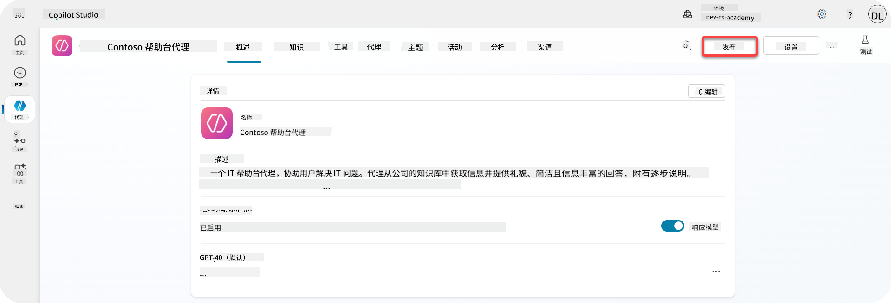

1. 在智能代理中选择**发布**按钮

    它会打开发布弹出窗口，确认您是否真的想发布智能代理。

    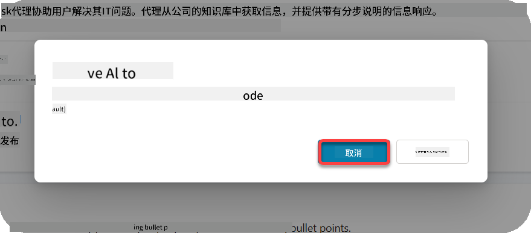

1. 选择**发布**以确认发布您的智能代理

    此时会显示一条消息，表明您的智能代理正在发布。您无需保持弹出窗口打开。当智能代理发布完成时，您会收到通知。

    

    当智能代理发布完成后，您会在智能代理页面顶部看到通知。

    

但是——我们只是发布了智能代理，还没有将其添加到渠道中，所以现在让我们来解决这个问题！

### 11.2 添加Teams和Microsoft 365 Copilot渠道

1. 要将Teams和Microsoft 365 Copilot渠道添加到我们的智能代理，我们需要在智能代理的顶部导航中选择**Channel**

    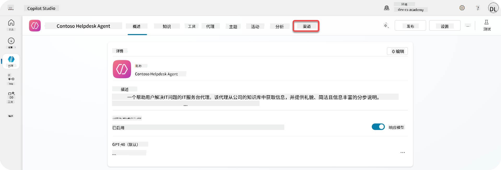

    在这里我们可以看到所有可以添加到此智能代理的渠道。

1. 选择**Teams和Microsoft 365**

    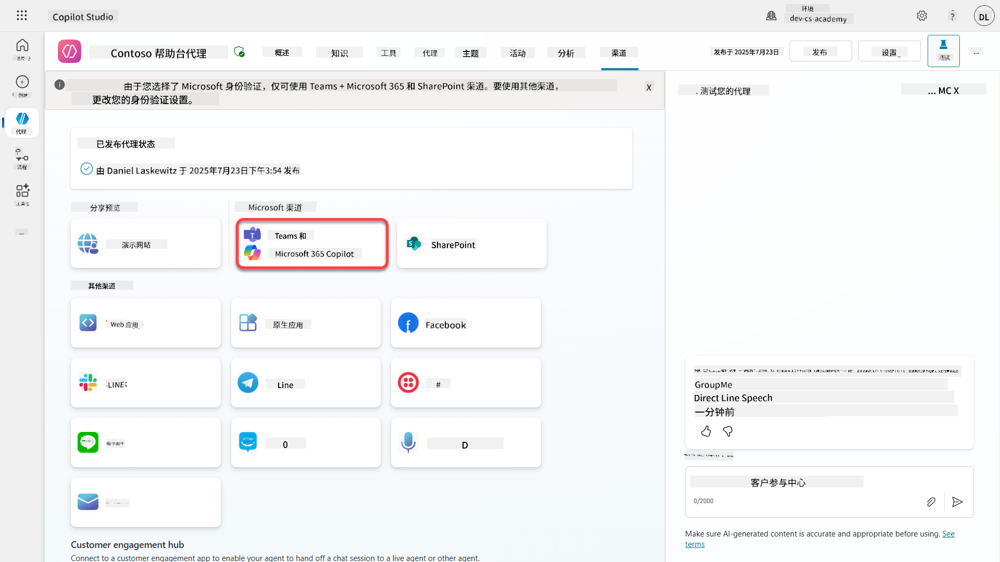

1. 选择**添加渠道**以完成向导并将渠道添加到智能代理

    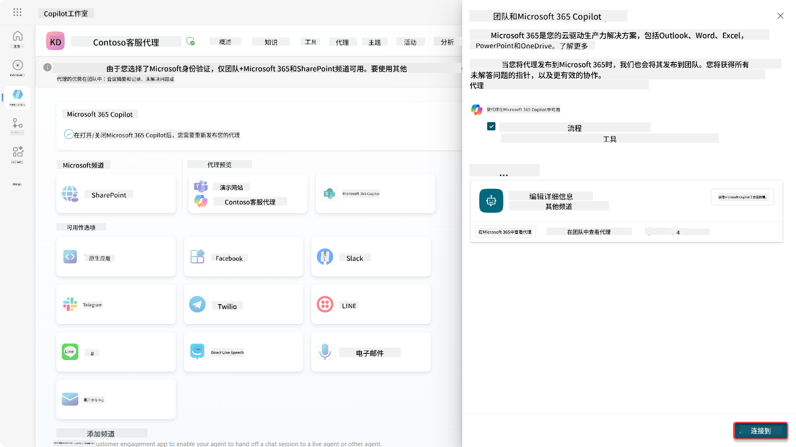

    添加过程需要一些时间。添加完成后，侧边栏顶部会出现绿色通知。

    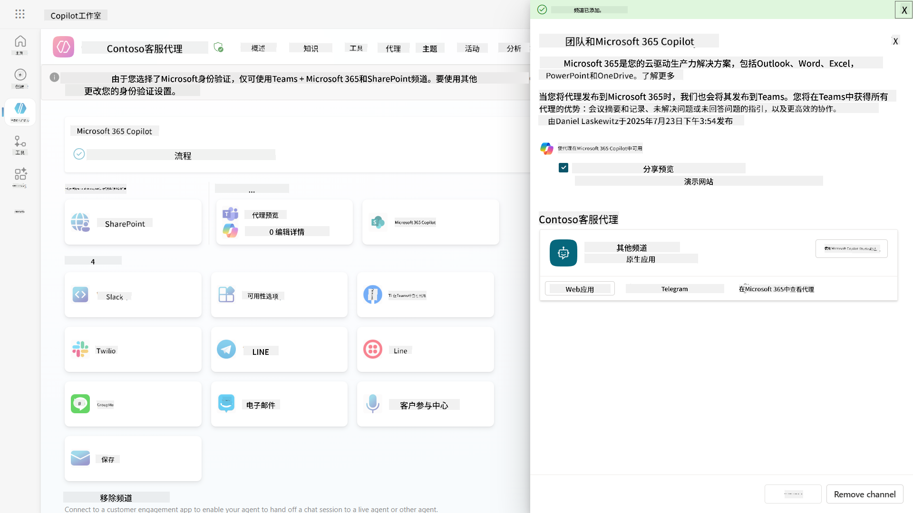

1. 选择**在Teams中查看智能代理**以打开一个新标签页

    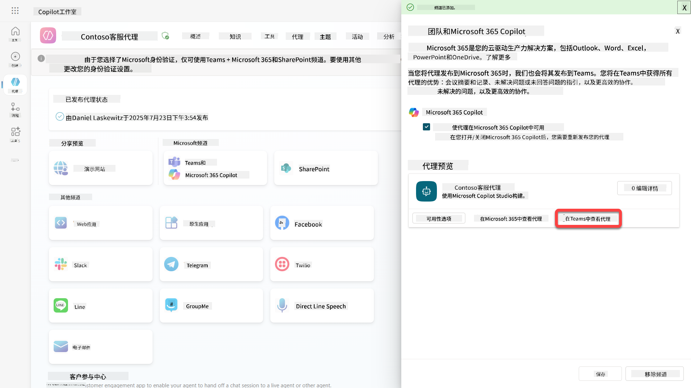

1. 选择**添加**以将Contoso Helpdesk Agent添加到Teams

    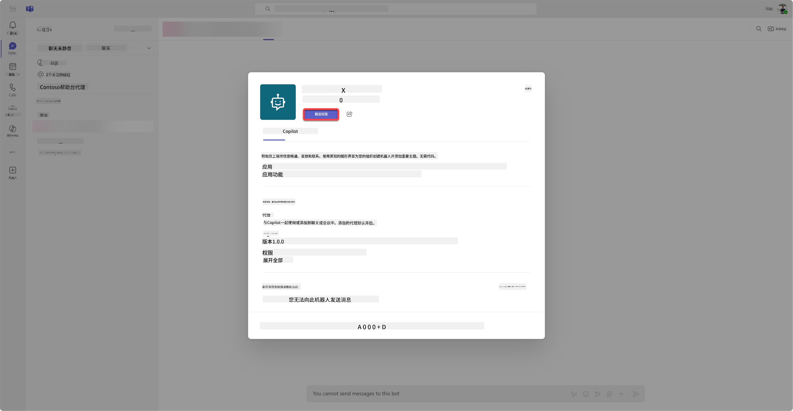

    这可能需要一些时间。完成后应该显示以下屏幕：

    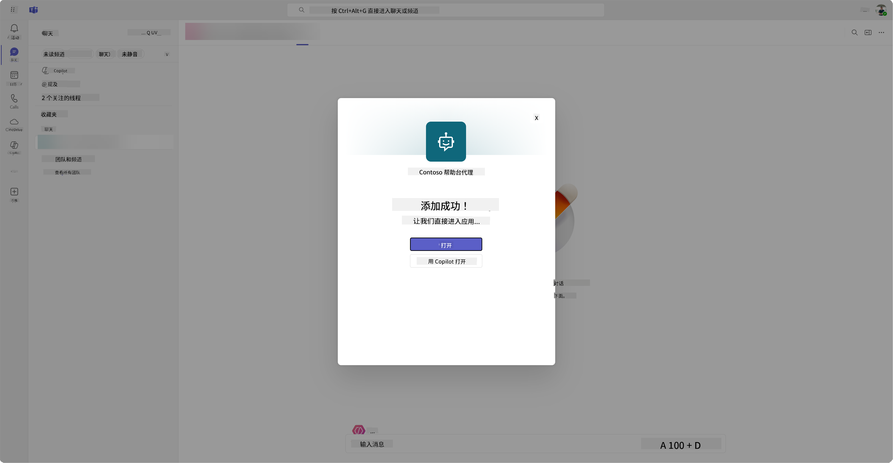

1. 选择**打开**以在Teams中打开智能代理

    这将以Teams应用的形式在Teams中打开智能代理。

    

现在我们已经将智能代理发布到Microsoft Teams中供您使用，但您可能希望让更多人可以使用它。

### 11.3 让整个租户的用户都能使用智能代理

1. 关闭打开Contoso Helpdesk Agent的浏览器标签页

    这将使您返回到Copilot Studio，此时Teams和Microsoft 365 Copilot侧边栏仍然打开。我们现在只是将智能代理打开在Teams中，但我们可以做更多的事情。我们可以编辑智能代理的详细信息，可以将智能代理部署给更多用户等等。

1. 选择**编辑详细信息**

    
这将打开一个窗格，我们可以在其中更改代理的许多详细信息和设置。我们可以更改基本信息，例如图标、图标的背景颜色和描述。我们还可以在这里更改 Teams 设置（例如允许用户将代理添加到团队，或允许在群组和会议聊天中使用此代理）。选择 *更多* 时，还可以更改开发者信息，例如开发者名称、网站、隐私声明和使用条款。

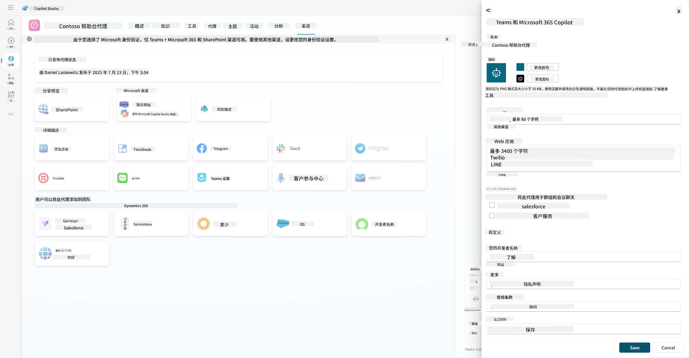

1. 选择 **取消** 以关闭编辑详细信息窗格

1. 选择 **可用性选项**

    

    这将打开可用性选项窗格，您可以复制一个链接发送给用户以使用此代理（请注意，您还需要与用户共享代理），并且可以下载一个文件以将您的代理添加到 Microsoft Teams 或 Microsoft 365 商店。要在商店中显示代理，还有其他选项：您可以将其显示给您的团队成员和共享用户（以显示在 *使用 Power Platform 构建* 部分），或者您可以将其显示给组织中的所有人（这需要管理员批准）。

1. 选择 **向我的组织中的所有人显示**

    

1. 选择 **提交以供管理员批准**

    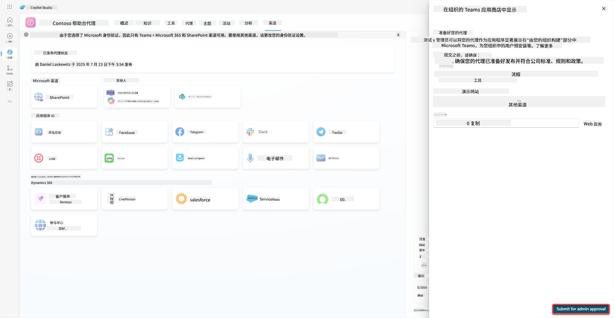

    现在，您的管理员需要批准您的代理提交。他们可以通过进入 Teams 管理中心并在应用中查找 Contoso Helpdesk Agent 来完成此操作。在截图中，您可以看到管理员在 Teams 管理中心会看到的内容。

    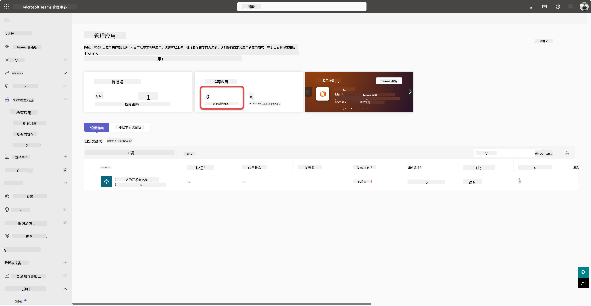

    管理员需要选择 Contoso Helpdesk Agent 并选择 *发布*，以将 Contoso Helpdesk Agent 发布给所有人。

    

    当管理员发布了代理提交后，您可以刷新 Copilot Studio，并且应该会在可用性选项中看到 *在应用商店中可用* 的横幅。

    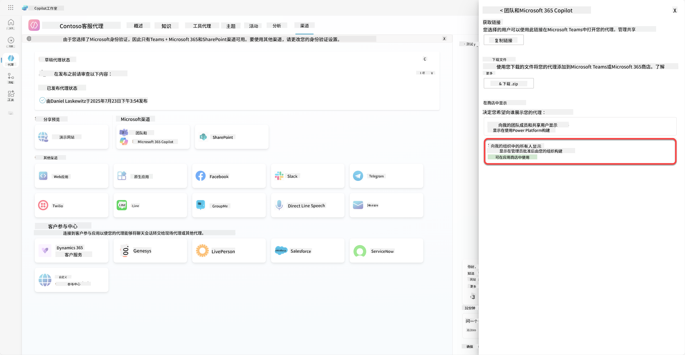

这里还有更多可能性。您的管理员可以更改全局设置策略，并为租户中的所有人自动安装 Contoso Helpdesk Agent。此外，您还可以将 Contoso Helpdesk Agent 固定到左侧栏，以便每个人都能轻松访问它。

## ✅ 任务完成

🎉 **恭喜！** 您已成功发布代理并将其添加到 Teams 和 Microsoft 365 Copilot！接下来是课程的最后一个任务：了解许可。

⏭️ [进入 **了解许可** 课程](../12-understanding-licensing/README.md)

## 📚 战术资源

🔗 [发布渠道文档](https://learn.microsoft.com/microsoft-copilot-studio/publication-fundamentals-publish-channels)

---

**免责声明**：  
本文档使用AI翻译服务[Co-op Translator](https://github.com/Azure/co-op-translator)进行翻译。尽管我们努力确保翻译的准确性，但请注意，自动翻译可能包含错误或不准确之处。原始语言的文档应被视为权威来源。对于重要信息，建议使用专业人工翻译。我们对因使用此翻译而产生的任何误解或误读不承担责任。